# <p align="center">PDS Project2 Report</p>
# <p align="center">案例与课件增强 部分</p>

**<p align="center">Masen Wen</p>**
**<p align="center">2025-12-05</p>**


* 实验代码&实验报告已上传Github
  * https://github.com/MasenWen


---
# **模块Ⅰ：数据库增强**


##### 工作1：filmdb.sql 结构分析与评估
- 1a. 关注filmdb数据库的结构
- 1b. 结构标准化
- 1c. 兼容性基线测试
- 1d. 优化点浅析

##### 工作2：新电影数据获取与清洗
- 诉诸Kaggle
- 覆盖和容错
- 存在的问题
- 数据清洗

##### 工作3：数据表更新
- 合并people表
- 合并movies表
- 创建credits_about
- 绑定movies和credits_about
- 绑定people和credits_about
- 合并到credits表

##### 工作4：新数据库测试
- 新的电影
- movies people credits 三表联查
- 一些"问题"的声明
- .sql导出
- OpenGauss兼容性

##### [拓展]工作5：影评与获奖
- 设计数据表相关结构
- 添加索引
- 添加外键
- 使用新场景


---
## **工作1**：filmdb.sql 结构分析与评估
新数据库需要保持和原数据库的一致性
新数据库需要保持简洁
新数据库需要考虑psql和opengauss的差异性
###
###   **1a. 关注filmdb数据库的结构**

使用 DataGrip 的数据库图表功能，可视化所有表、字段和关系。
创建新的数据库 做好数据版本隔离
DataGrip支持数据库作**全实体关系(ER)图**
由此我们可以分析出**核心数据表区**和**周边表区**的关系进而做出取舍
我们决定只关注表和关联表的部分信息 依次为需求寻找数据

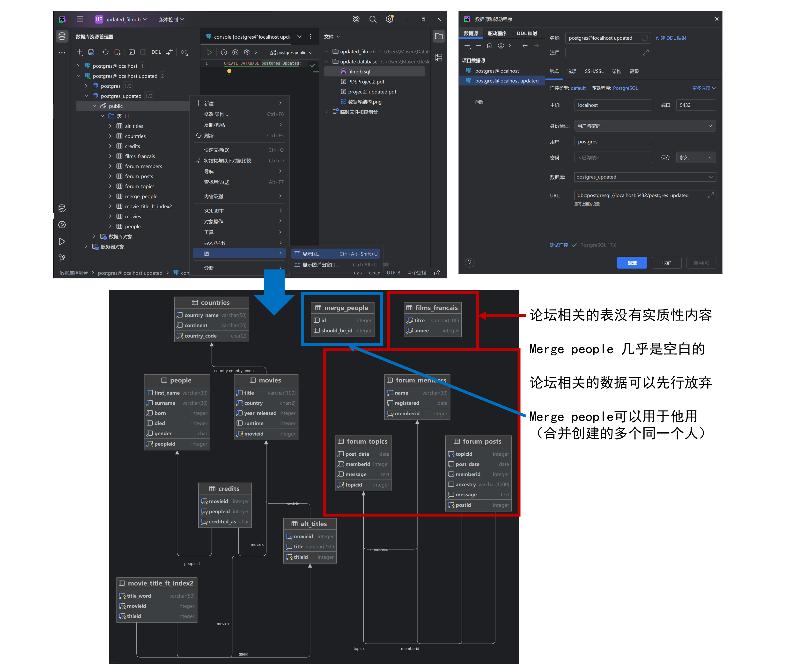

---

### **1b. 结构标准化**：(阅读请优先关注加粗内容)
* 我们关注表和关联表的以下信息：
  - 字段名、数据类型、是否允许空值
  - 主键、外键约束
  - 现有索引
  - 其他约束
  - **论坛等无用部分已经被舍弃**


**数据表结构调取**


```sql
select table_schema, table_name, column_name, data_type, is_nullable
from information_schema.columns where table_name = 'movies'
                                   or table_name = 'people'
                                   or table_name = 'credits'
                                   or table_name = 'countries'
                                   or table_name = 'alt_titles';
```

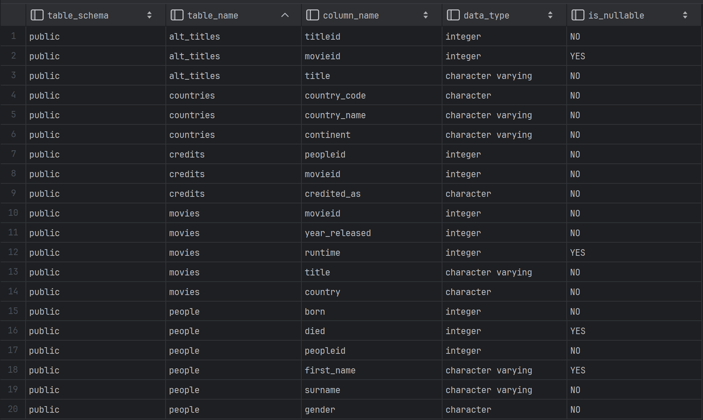

**数据表结构分析**


| 表名 | 描述 | 主键 (PK) | 唯一约束 (Unique) | 重要的非空约束 (NOT NULL) |
| :--- | :--- | :--- | :--- | :--- |
| **countries** | 国家/地区信息 | `country_code` | `country_name` | `country_code`, `country_name`, `continent` |
| **movies** | 电影主要信息 | `movieid` | `(title, country, year_released)` 复合唯一 | `movieid`, `title`, `country`, `year_released` |
| **people** | 人物信息（导演、演员） | `personid` | \<NULL\> | `personid`, `name` |
| **directors** | 电影与导演的关联 | `(movieid, personid)` 复合主键 | \<NULL\> | `movieid`, `personid` |
| **actors** | 电影与演员的关联 | `(movieid, personid)` 复合主键 | `(movieid, credit_as)` (同一部电影中演员的出演顺序唯一) | `movieid`, `personid`, `credit_as` |
| **alt_titles** | 电影的备用标题 | `alt_id` | \<NULL\> | `alt_id`, `movieid`, `title` |
| **merge_people** | (辅助表) 人物合并信息 | \<NULL\> | \<NULL\> | \<NULL\> |


**列的额外约束 (Check Constraints) (修正)**

数据库中使用了大量的 `CHECK` 约束来确保数据格式和长度： **这些约束是应该被维护的 我想大部分新添加的电影也不会违反约束**

* **长度限制:** 几乎所有 `CHAR/VARCHAR` 字段都有限制
* **数值校验:** 所有主键和外键字段（如 `movieid`, `personid`）以及 `movies.year_released` 和 `movies.runtime` 都使用了 `CHECK` 约束确保它们是数值类型（例如 `year_released+0=year_released`）


**表间关系（外键依赖）(修正)**

| 子表 (Foreign Key) | 依赖的父表 (Primary Key) | 关联字段 | 关系类型 |
| :--- | :--- | :--- | :--- |
| **movies** | `countries` | `movies.country` 依赖 `countries.country_code` | 1:N (一个国家有多部电影) |
| **directors** | `movies` | `directors.movieid` 依赖 `movies.movieid` | N:M 关联 (多对多) |
| **directors** | `people` | `directors.personid` 依赖 `people.personid` | N:M 关联 (多对多) |
| **actors** | `movies` | `actors.movieid` 依赖 `movies.movieid` | N:M 关联 (多对多) |
| **actors** | `people` | `actors.personid` 依赖 `people.personid` | N:M 关联 (多对多) |
| **alt_titles** | `movies` | `alt_titles.movieid` 依赖 `movies.movieid` | 1:N (一部电影有多个别名) |


**现有索引**

没有明确的 `CREATE INDEX` 语句。**所有索引都是数据库系统为主键和Unique自动创建的隐式索引**。

以下字段/组合列**已存在索引**：

* `countries`: `country_code` (PK), `country_name` (Unique)
* `movies`: `movieid` (PK), `(title, country, year_released)` (Unique)
* 关联表 credits(`directors`, `actors`): 复合主键


### **直观表示**
第一节课提到了完整但极其冗余的单表数据库 然而 **这种形式有利于我们明确目标数据(新电影)的数据要求** 我们以StarWars为例
**我做了以下标注**: 
  * \[\*]重要需要获取的数据
  * \[~]不重要数据

id/code类数据是自动生成的
actors/directors要整理为credits表(这里为了表示方便)
这样看来 **需要获取的核心信息并不多** 归结为 电影标题（`movies.title`）、上映年份（`movies.year_released`）、电影时长（`movies.runtime`）、国家全名（`countries.country_name`）、所属大洲（`countries.continent`）、人物全名（`people.name`）、出生日期（`people.birth_date`）、逝世日期（`people.death_date`）、性别（`people.gender`）。
能获取最好的数据包括 电影的备用标题（`alt_titles.title`）

### **所需全部信息表**


| 属性 | 所属表格 | 字段名称 (Column Name) + 标记 | 键/约束标识 | 限制 (Constraint) | Star Wars 示例值 | Star Wars 示例值 (...) |
| :--- | :--- | :--- | :--- | :--- | :--- | :--- |
| **主信息** | `movies` | **movieid** | **PK** | NN, 整数 | **144** | - |
| | `movies` | **title** \[\*] | **U** | NN, Varchar(100) | **Star Wars: A New Hope** | - |
| | `movies` | **country** | **U/FK** | NN, Char(2), Ref `countries` | **us** | - |
| | `movies` | **year\_released** \[\*] | **U** | NN, 整数 | **1977** | - |
| | `movies` | runtime \[\*] | - | 整数 | 121 | - |
| **国家** | `countries` | **country\_code** | **PK** | NN, Char(2) | us | - |
| | `countries` | **country\_name** \[\*] | **U** | NN, Varchar(50) | United States | - |
| | `countries` | continent \[\*] | - | NN, Varchar(20) | NORTH AMERICA | - |
| **人物** | `people` | **personid** | **PK** | NN, 整数 | **22** | **20** |
| | `people` | name \[\*] | - | NN, Varchar(100) | George Lucas | Mark Hamill |
| | `people` | birth\_date \[\*] | - | 日期/NULL | 1944-05-14 | 1951-09-25 |
| | `people` | death\_date \[\*] | - | 日期/NULL | NULL | NULL |
| | `people` | gender \[\*] | - | Char/NULL | M | M |
| **导演关联** | `directors` | **movieid** | **PK/FK** | NN | **144** | - |
| | `directors` | **personid** | **PK/FK** | NN | **22** | - |
| **演员关联** | `actors` | **movieid** | **PK/U/FK** | NN | **144** | **144** |
| | `actors` | **personid** | **PK/FK** | NN | **20** | **21** |
| | `actors` | **credit\_as** \[\*] | **U** | NN, 整数 | **1** | **2** |
| **备用标题** | `alt_titles` | **title\_id** | **PK** | NN, 整数 | **30** | **31** |
| | `alt_titles` | **movieid** | **FK** | NN | **144** | **144** |
| | `alt\_titles` | title \[~] | - | NN, Varchar(100) | Star Wars IV: A New Hope | Star Wars: Episode IV |


### **总结:确定的范式和必要的妥协**
**综上所述**： 在添加数据时 我们也应该维持这样的模式 考虑到后添加的电影和已有电影是等地位的 我们只需要维持Insert语句的格式 为了达到这样的效果 我们可能需要对数据进行清洗和调整（我倾向于使用大模型+脚本）
**如有问题**：考虑到此数据库的学习性质 如果对于有些电影 不能严格满足范式 我们完全可以填入片面的数据/NULL（只要不影响查询效果）
###

---
###   **1c. 兼容性基线测试**：
基于Project1的观察 在 PostgreSQL 和 openGauss 中运行filmdb.sql文件的要求是不同的。错误分类与分析：

### 1. 数据完整性约束错误（Data Integrity Constraint Error）

| 错误代码 (SQLSTATE) | 错误信息（摘录） | 涉及对象 |
| :------------------ | :--------------- | :------- |
| [cite_start]`[23502]` [cite: 798] | `ERROR: null value in column "surname" violates not-null constraint` | `people` 表的 `surname` 列 |

**openGauss比Postgres更严格:**

 **约束定义:** `people` 表中的 `surname` 列显然被定义为 `NOT NULL`（非空）约束。
 在 PostgreSQL (psql) 中，对于 `VARCHAR` 或 `TEXT` 类型的列，空字符串（`''`）通常被视为一个**有效的非 NULL 值**。
  然而，openGauss将空字符串 `''` 视为了 `NULL` 值。
相比 psql，openGauss（或其驱动/配置）可能对空字符串的处理更加严格，或者在数据类型转换/约束检查方面有着细微差异，导致原本在 psql 中通过的空字符串被判定为 `NULL`，从而触发了 `NOT NULL` 约束错误。
**选择：** 在project1处理这个问题时 我**把所有''替换为' ' 这样只影响小部分数据 课上提到 name 为''的情况时艺名等(如'成龙') 这样的数据会需要在查找中使用' 成龙'或'成龙 ' 但这样会导致查询失效 不符合数据库要求
**解决：** 去掉了所有的`Not Null`


### 2. 数据完整性约束错误（Data Integrity Constraint Error）

| 错误代码 (SQLSTATE) | 错误信息（摘录） | 涉及对象 |
| :------------------ | :--------------- | :------- |
| `[23502]` | `ERROR: null value in column "title" violates not-null constraint` | `alt_titles` 表的 `title` 列 |
| `[23502]` | `详细：Failing row contains (1226, 4767, null).` | `alt_titles` 表的 `title` 列 |

**解决：** 去掉了所有的 `Not Null`

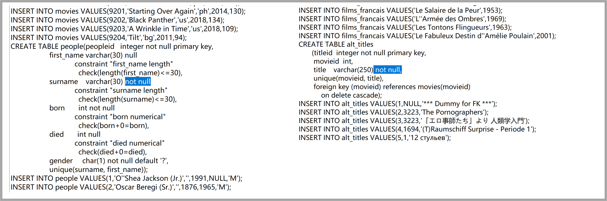

### 3. 事务状态错误/级联错误（Transaction State Error/Cascading Failure）

这是一个**继发错误**。

| 错误代码 (SQLSTATE) | 错误信息（摘录） | 涉及对象 |
| :------------------ | :--------------- | :------- |
| [cite_start]`[25P02]` [cite: 799] | `ERROR: current transaction is aborted, commands ignored until end of transaction block` | 第一次错误后的所有 `INSERT` 和 `CREATE TABLE` 语句 |

1. 事务块内的语句失败，整个事务标记为**中止**状态（Aborted）
2. 中止状态事务块内所有后续的 SQL 命令都被忽略，并返回错误

**解决：** 其他错误被解决后 这个报错也会随之消失
###

---
###   **1d. 优化点浅析**：

鉴于要添加数据的复杂操作，决定只保留**标准且必要**的优化。额外的优化可以在数据库完整后再考虑。

**AI两个失败的提议**：基于常见的查询场景，以下外键（Foreign Key, FK）或常用查询字段缺少独立索引，可能导致性能瓶颈：

1.  **`alt_titles(movieid)`**:
    * **问题:** 类似地，`alt_titles` 表的主键是 `title_id`，`movieid` 没有独立索引。
    * **优化:** 查询一部电影的所有备用标题时（例如 `SELECT * FROM alt_titles WHERE movieid = X`），需要全表扫描。**建议**为 `alt_titles.movieid` 字段添加索引。

2.  **`movies(country)`**:
    * **问题:** `country` 是外键，但它不是 `movies` 表复合唯一约束的最左列 (`(title, country, year_released)`)，因此无法单独利用该索引。
    * **优化:** 如果需要经常查询某个国家的所有电影（例如 `SELECT * FROM movies WHERE country = 'us'`），**建议**为 `movies.country` 字段添加索引。


对于**别名索引** 原表设定了(movieid,title)索引 这导致单独查询的效率受影响(课上练习我们可以感受到)
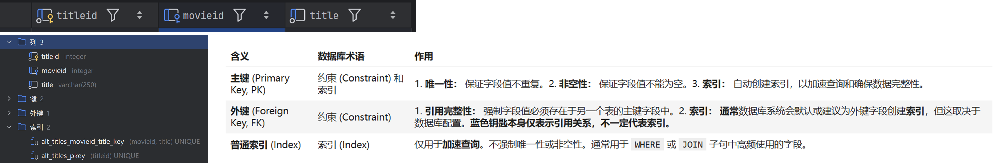
然而 考虑到逆向的别名查询在课程中/使用中出现的频率很低 添加索引是不必要的


对于**国家索引** 课上提及了这个例子 鉴于电影产业在国别上的极度不均衡 只有电影小国的索引是有优化的 而小国电影的出现频率很低 添加索引是不必要的


##### **AI偏向做加法 但我们要多做减法**
##### AI提示我们从这几个方面分析索引的必要性 但其分析并不总是合理
1. 查询频率与重要性 (Why We Query)
2. 表的大小 (Size Matters)
3. 字段的选择性 (Selectivity)
4. 关系的类型 (Foreign Key vs. Index)


---
## **工作2**： 新电影数据获取与清洗
寻找2018年及以后以后的电影
数据内容大小应该适中5000-10000部
数据清洗与去重


## **诉诸Kaggle**
经检索 我找到了完美符合要求的一组.csv表格 对应了完整但movies/credit和people数据表
由此 尽管课上提到了**网络爬虫** 在和做过网爬实习的朋友沟通后 我决定就此绕开和网页/反爬的纠缠
有现成的数据理应**一切从简**
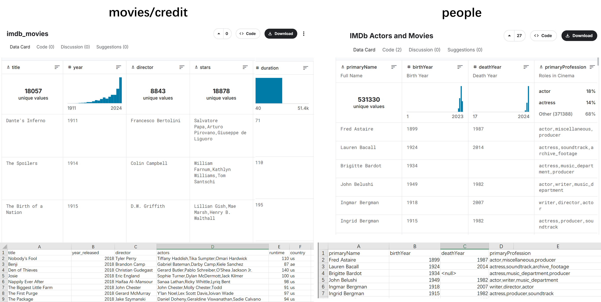
[表1]电影表 https://www.kaggle.com/datasets/lexuanhieuai/imdb-movies
[表2]演员表 https://www.kaggle.com/datasets/rishabjadhav/imdb-actors-and-movies


### **覆盖和容错**
**[表1]** 有6000条左右的2018年以后的数据 包含国家范围广 语系丰富 (尽管以美国电影为主 中国电影偏少)
**[表2]** 有足够多的影视圈人物 可以很好的覆盖数据库要求范围
几乎所有的基本列都被覆盖了 没有覆盖的也有足够的信息来推出
高质量数据非常充足 对于少数棘手的数据完全可以放弃
有大量的评价信息 后续添加forum板块可以直接使用


### **存在的问题**(都容易解决)
**[表1]** 只区分了演员和导演 演员间和导演间的划分需要后续完成
**[表2]** 体量太大 不能用编辑器操作 必须导入数据库后操作 删去所有在2018年前去世的条目后会解决这一问题(新表对旧表的影响要么是拍电影 要么是去世 已经故去的不会影响)
**[表2]** 没有gender列 **解决方案** [表2]的credit列不是a/d 而是提供了具体到actor/actress/...的内容 根据%LIKE%'actor/actress'可以导出性别
**[表2]** 没有拆分first name和surname **解决方案** 需要根据规则写脚本拆解 放弃少量异常数据
没有别名信息 这不是特别重要

## **数据清洗**
### **new_movies**
只需要删除部分列并导入数据库即可
### **people_about**
我们用DataGrip处理name.csv数据表
导入name.csv数据表为表people_about
执行以下操作：


```sql
-- 1. 添加 gender 列
ALTER TABLE people_about
ADD COLUMN gender CHAR(1);

-- 2. 根据 primaryprofession 列更新 gender 值
UPDATE people_about
SET gender = 'F'
WHERE primaryprofession ILIKE '%actress%';

UPDATE people_about
SET gender = 'M'
WHERE primaryprofession ILIKE '%actor%'
  AND primaryprofession NOT ILIKE '%actress%';

-- 3. \N 替换为真正的 \<null\> 值
UPDATE people_about
SET birthyear = NULL
WHERE birthyear = '\N';

UPDATE people_about
SET deathyear = NULL
WHERE deathyear = '\N';

UPDATE people_about
SET primaryprofession = NULL
WHERE primaryprofession = '\N';

-- 4. 删除所有在 2017 年及以前去世的人的条目
DELETE FROM people_about
WHERE deathyear IS NOT NULL AND CAST(deathyear AS INT) <= 2017;

-- 5. 准备新的姓名列并拆分 (原primaryname列仍然存在)
ALTER TABLE people_about
ADD COLUMN first_name VARCHAR(100),
ADD COLUMN surname VARCHAR(100);

-- 6. 拆分姓名
UPDATE people_about
SET
    surname = TRIM(SUBSTRING(primaryname FROM '\s(\S+)$')),
    first_name = TRIM(SUBSTRING(primaryname FROM '^(.*?)\s'))
WHERE primaryname IS NOT NULL
  AND primaryname LIKE '% %';

-- 7. 处理单名(艺名)：将整个名字赋值给 surname，first_name 设为 \<null\>
UPDATE people_about
SET
    surname = primaryname,
    first_name = NULL
WHERE primaryname IS NOT NULL
  AND primaryname NOT LIKE '% %';

-- 8. 删除旧的 primaryname 列
ALTER TABLE people_about
DROP COLUMN primaryname;


-- 9. 删除出生年份(birthyear) 为 \<null\> 的所有行
DELETE FROM people_about
WHERE birthyear IS NULL;
```

而后我们稍加修改 并添加id
从17000开始编码 剩余的演员和导演数量有10万条之多
两部分数据已经完全对应
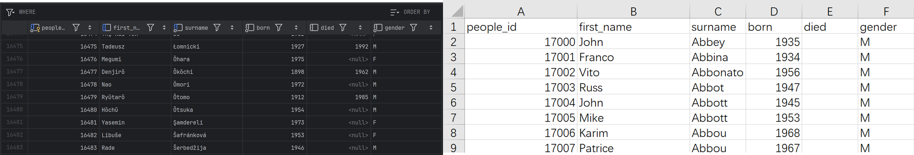


---
## **工作3**：数据表更新
## **合并people表**


```sql
-- 1. 更新 people 表中已匹配行的 died 字段
UPDATE people p
SET died = pa2.died
FROM people_about_2 pa2
WHERE
    p.surname = pa2.surname
    AND p.first_name = pa2.first_name
    AND p.born = pa2.born
    AND p.died IS NULL
    AND pa2.died IS NOT NULL;


-- 2. 纵向合并：插入不冲突的新行
WITH ExistingMaxID AS (
    SELECT COALESCE(MAX(peopleid), 0) AS max_id
    FROM people
),
NewRows AS (
    SELECT DISTINCT ON (pa2.surname, pa2.first_name)
           pa2.first_name, pa2.surname, pa2.born, pa2.died, pa2.gender
    FROM people_about_2 pa2
    WHERE NOT EXISTS (
        SELECT 1
        FROM people p
        WHERE
            p.surname = pa2.surname
            AND p.first_name = pa2.first_name
    )
    ORDER BY pa2.surname, pa2.first_name, pa2.born
)
INSERT INTO people (peopleid, first_name, surname, born, died, gender)
SELECT
    (SELECT max_id FROM ExistingMaxID) + ROW_NUMBER() OVER (ORDER BY nr.surname, nr.first_name, nr.born),
    nr.first_name,
    nr.surname,
    nr.born,
    nr.died,
    nr.gender
FROM NewRows nr;
```

### 更新后的people数据表有了10万+条数据


## **合并movies表**


```sql
-- 1. 合并操作：更新 movies 表中已匹配电影的缺失 runtime/country 值
-- 匹配依据：title 和 year_released 相同
UPDATE movies m
SET
    runtime = nm.runtime,
    country = nm.country
FROM new_movies nm
WHERE
    m.title = nm.title
    AND m.year_released = nm.year_released
    AND (m.runtime IS NULL OR m.country IS NULL)
    AND (nm.runtime IS NOT NULL OR nm.country IS NOT NULL);


-- 2. 纵向合并new_movies中不重复的新行
WITH ExistingMaxID AS (
    SELECT COALESCE(MAX(movieid), 0) AS max_id
    FROM movies
),
NewRows AS (
    SELECT DISTINCT ON (nm.title, nm.year_released)
           nm.title, nm.country, nm.year_released, nm.runtime
    FROM new_movies nm
    WHERE
        nm.country IS NOT NULL
        AND NOT EXISTS (
        SELECT 1
        FROM movies m
        WHERE
            m.title = nm.title
            AND m.year_released = nm.year_released
    )
    ORDER BY nm.title, nm.year_released
)
INSERT INTO movies (movieid, title, country, year_released, runtime)
SELECT
    (SELECT max_id FROM ExistingMaxID) + ROW_NUMBER() OVER (ORDER BY nr.title, nr.year_released),
    nr.title,
    nr.country,
    nr.year_released,
    nr.runtime
FROM NewRows nr;
```

### 更新后数据库有了5000多条新数据(因为年份基本不重复所有几乎没有重复的行)

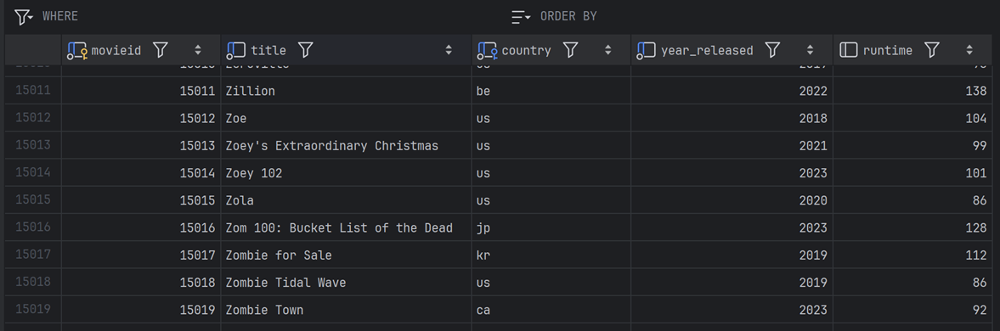

## **创建credits_about**
导入new_movies原表(除了电影信息还有电影的剧组信息) 删除和电影相关的内容留下movieid(无效数据但要保留列) title actors directors
### **绑定movies和credits_about**(名称暂时被改变 后续我们改回来)


```sql
-- 1. 创建 movie_credits_expanded 表
DROP TABLE IF EXISTS movie_credits_expanded;

CREATE TABLE movie_credits_expanded (
    movieid INTEGER NOT NULL,
    title VARCHAR(255),
    people VARCHAR(255) NOT NULL,
    credited_as CHAR(1) NOT NULL,
    UNIQUE (movieid, people, credited_as)
);

-- 2. 连接到 movies 表 去重

WITH ExpandedCredits AS (
    SELECT c.title, TRIM(regexp_split_to_table(c.director, ',')) AS people, 'D' AS credited_as
    FROM credits_about c
    WHERE c.director IS NOT NULL AND c.director != ''

    UNION ALL

    SELECT c.title, TRIM(regexp_split_to_table(c.actors, ',')) AS people, 'A' AS credited_as
    FROM credits_about c
    WHERE c.actors IS NOT NULL AND c.actors != ''
)
-- 从movies中得到正确的movieid
INSERT INTO movie_credits_expanded (movieid, title, people, credited_as)
SELECT
    m.movieid,
    ec.title,
    ec.people,
    ec.credited_as
FROM ExpandedCredits ec
JOIN movies m ON ec.title = m.title
GROUP BY m.movieid, ec.title, ec.people, ec.credited_as;
```

### **绑定people和credits_about**(同理)


```sql
-- 1. 创建一个 IMMUTABLE 函数来包装 TRIM 并添加索引
CREATE OR REPLACE FUNCTION safe_trim(text)
RETURNS text AS $$
    SELECT TRIM($1);
$$ LANGUAGE SQL IMMUTABLE;

-- 2. 创建一个 IMMUTABLE 函数来包装 CONCAT_WS( )
CREATE OR REPLACE FUNCTION safe_concat_ws(text, text, text)
RETURNS text AS $$
    SELECT CONCAT_WS($1, $2, $3);
$$ LANGUAGE SQL IMMUTABLE;

-- 3. 姓名拼接逻辑
CREATE OR REPLACE FUNCTION full_name_concat(first_name text, surname text)
RETURNS text AS $$
    SELECT TRIM(CONCAT_WS(' ', TRIM(first_name), TRIM(surname)));
$$ LANGUAGE SQL IMMUTABLE;

-- 4. 在 people 表上创建全名索引
CREATE INDEX idx_people_fullname ON people
    USING btree (full_name_concat(first_name, surname));

-- 5. 在 movie_credits_expanded 表的 people 字段上创建索引
CREATE INDEX idx_mce_people_trim ON movie_credits_expanded
    USING btree (safe_trim(people));

-- 6. 清理目标表
DROP TABLE IF EXISTS final_credits;

CREATE TABLE final_credits (
    movieid INTEGER NOT NULL,
    title VARCHAR(255),
    people_id INTEGER NOT NULL,
    credited_as CHAR(1) NOT NULL,
    people_full_name VARCHAR(255) NOT NULL,
    gender CHAR(1),
    born INTEGER,
    UNIQUE (movieid, people_id, credited_as)
);

-- 7. 执行连接和插入操作
INSERT INTO final_credits (movieid, title, people_id, credited_as, people_full_name, gender, born)
SELECT
    mce.movieid,
    mce.title,
    p.peopleid,
    mce.credited_as,
    TRIM(CONCAT_WS(' ', TRIM(p.first_name), TRIM(p.surname))) AS people_full_name_matched,
    p.gender,
    p.born
FROM
    movie_credits_expanded mce
INNER JOIN
    people p ON (
        safe_trim(mce.people) = full_name_concat(p.first_name, p.surname)
    )
    OR (
        p.first_name IS NULL
        AND safe_trim(mce.people) = safe_trim(p.surname)
    )
    OR (
        p.surname IS NULL
        AND safe_trim(mce.people) = safe_trim(p.first_name)
    );
```

不添加索引直接使用CONCAT_WS( )是一个非常糟糕的选择 这是一个函数而放弃了非批量操作 运行几十分钟依旧没有结果


**字符串连接查询导致索引失效**
1. 数据库在尝试连接 `people` 表和 `movie_credits_expanded` 表时，因为 `JOIN` 条件中使用了 **`CONCAT_WS()`** 和 **`TRIM()`** 等**函数**来拼接和清理姓名。
2. 数据库无法使用建立在原始列上的索引，必须对其中一张表进行**全表扫描**，并对每一行执行复杂的字符串函数计算，从而导致性能急剧下降，操作变得极其缓慢。


因此不得不使用如此复杂的插入代码

### 现在需要的movieid peopleid credited_as都已经具备

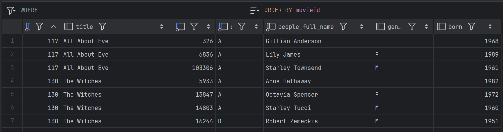

### **合并到credits表**
将表的名称改回credits_about
删掉多余的行
credit_about表的补丁有不到10000行 考虑到5000行新电影每个都有不止2个剧组人员 我们不得不承认很多电影的剧组并没有被充分覆盖 原本的数据库是8000条电影对应40000行credits 经查也有部分电影没有剧组人员信息 这样的差别可以接受


### **合并操作**
检查冲突其实是不必要的 因为credits_about和credits在时间上有严格划分


```sql
-- 1. 纵向合并
INSERT INTO credits (movieid, peopleid, credited_as)
SELECT DISTINCT
    fc.movieid,
    fc.people_id,
    fc.credited_as
FROM
    final_credits fc
WHERE NOT EXISTS (
    SELECT 1
    FROM credits c
    WHERE
        c.movieid = fc.movieid
        AND c.peopleid = fc.people_id
        AND c.credited_as = fc.credited_as
);
```

---
## **工作4：新数据库测试**
**15000部电影(最晚到2024年)**
**120000演员和导演**

## 新的电影


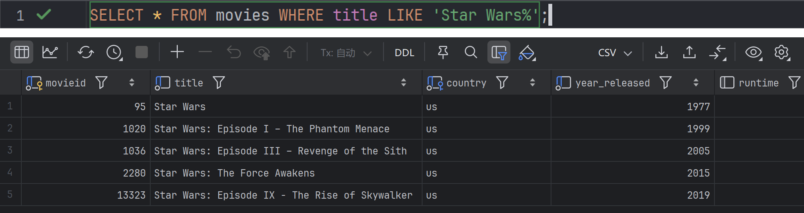
## movies people credits 三表联查


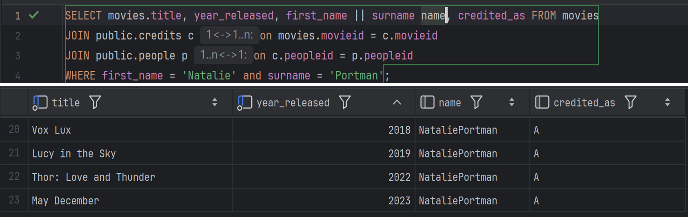

## **一些"问题"的声明**
根据课上的经验 常见的问题(100+条)是姓名相反的两条数据被认为是不同的演员
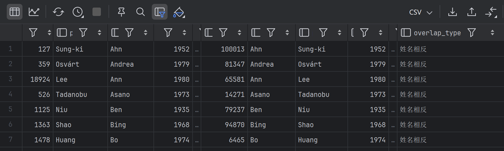
课上有这个内容相关的练习 考虑到100条并不影响大局 我决定保留并在后续添加一个解决这个问题的练习


一个新的问题是随着近年(2018~2024)影片的国际化 很多电影的引进版本(可能经过了删减重新配音等)被认为是不同的电影
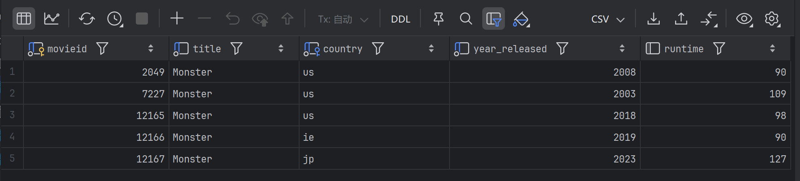
他们有着不同的国别和发行时间 写判断语句并删除并不困难 但是我决定保留


## **.sql导出**
输出为一个.sql脚本(为原脚本的5倍大小)


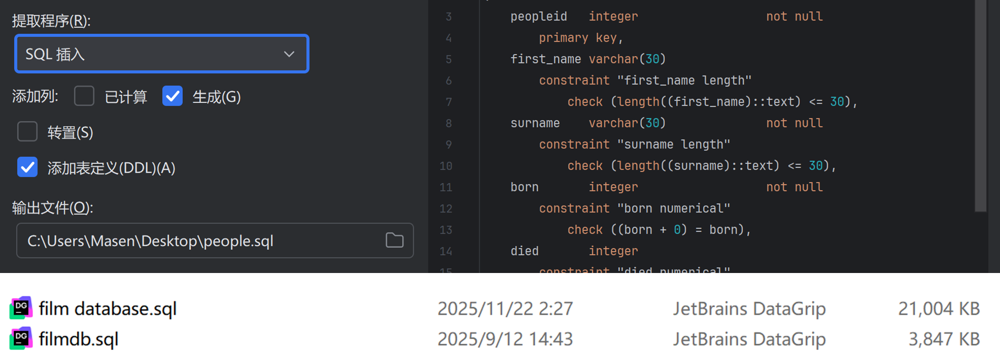


## **OpenGauss兼容性**
尝试用OpenGauss导入
出现了先前讨论过的报错 同理解决后正常运行
还有一些不影响运行的警告


---
## **[拓展]工作5：影评与获奖**

## **设计数据表相关结构**
forum相关的三张表不是数据库的真实数据 而是课上的这个例子 没有在Lab中被有效使用


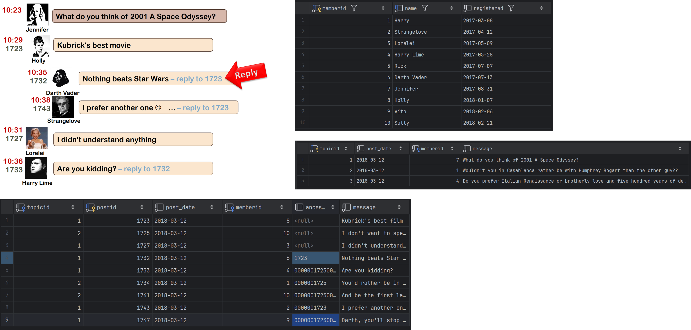


### 在这个表以外 填充一些真实的review信息
[表1]电影表 https://www.kaggle.com/datasets/lexuanhieuai/imdb-movies
利用[表1]中的相关数据 得到一张包含了movieid, overview, rating, num_rating, num_user_review, num_critic, metascore, oscar, nomination的表
**10000部电影有影评**


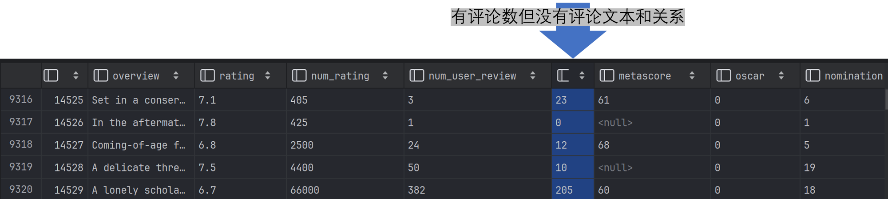


## **添加索引**
movieid是PrimaryKey
考虑到评分,数量等都是较为稀疏的有限值 我们添加索引


```sql
-- 1. 设置主键（PRIMARY KEY）movieid
ALTER TABLE reviews
ADD CONSTRAINT pk_reviews_movieid PRIMARY KEY (movieid);

-- 2. 索引
-- 索引 rating（电影评分）
CREATE INDEX idx_reviews_rating ON reviews (rating);

-- 索引 num_rating（评分总数）
CREATE INDEX idx_reviews_num_rating ON reviews (num_rating);

-- 索引 metascore（专业评分）
CREATE INDEX idx_reviews_metascore ON reviews (metascore);

-- 索引 nomination（提名数量）
CREATE INDEX idx_reviews_nomination ON reviews (nomination);
```

## **添加外键**


```sql
ALTER TABLE reviews
ADD CONSTRAINT fk_reviews_movieid
    FOREIGN KEY (movieid)
    REFERENCES movies (movieid)
    ON DELETE CASCADE;
```

## **使用新场景**
统计导演生涯中电影被提名了多少次才拿到了第一座奥斯卡奖(由于没有具体的奖项 我们把什么奖都算上)


```sql
WITH DirectorCareer AS (
    SELECT
        t1.peopleid AS director_id,
        t3.year_released AS year,
        t2.nomination,
        t2.oscar,
        t2.movieid
    FROM credits t1
    JOIN reviews t2 ON t1.movieid = t2.movieid
    JOIN movies t3 ON t1.movieid = t3.movieid
    WHERE t1.credited_as = 'D'
),
FirstWinYear AS (
    SELECT
        director_id,
        MIN(year) AS first_win_year
    FROM DirectorCareer
    WHERE oscar > 0
    GROUP BY director_id
),
TimesToWin AS (
    SELECT
        dw.director_id,
        (
            SELECT COUNT(dc.movieid)
            FROM DirectorCareer dc
            WHERE dc.director_id = dw.director_id
              AND dc.year <= dw.first_win_year
              AND dc.nomination > 0
        ) AS total_nominated_projects
    FROM FirstWinYear dw
)
SELECT
    total_nominated_projects AS times,
    COUNT(director_id) AS count
FROM TimesToWin
GROUP BY times
ORDER BY times;
```


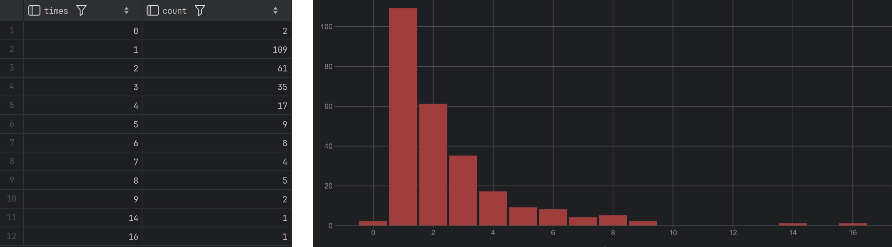
要注意的是有2条数据没有经过提名就获得了奥斯卡奖 经检查数据库里一共有4部电影0提名获奖 经查这是数据问题


## **新数据库的结构如下**


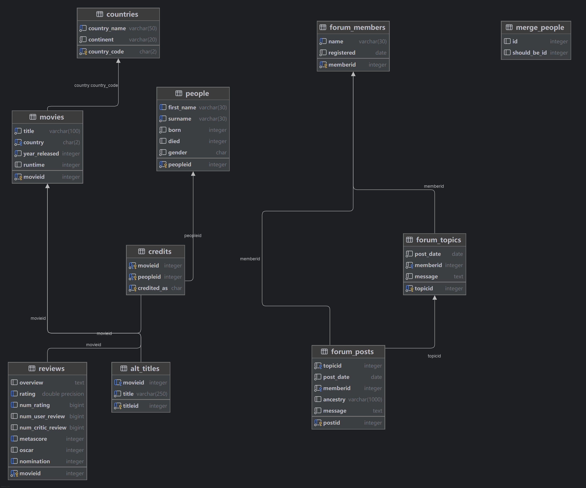

---
# **模块Ⅱ：CS_213(H)课程增强**


## **工作0**：PPT审改
### https://github.com/MasenWen/Update-Database/blob/master/Review_Notes/Review_Notes.md

## **工作1**：走访学长、查阅网评、对比课件

* **走访学长**
  * 在开始这部分Project的时候 我和一些学长交流了意见
  * 学长表示：本课难学
* **查阅网评**
  * 查阅了评教网  https://ncesnext.com/course/7763/ 数据库原理(H)
  * 有评价说："数据库原理不讲原理" 
  * 有评价说："竟然不知网上有现成的仓库"可供参考
  * 于是我想：网上资源有必要加一些引导
* **对比课件**
  * 实际看过了所有的课件 平心而论 **对于原理的覆盖是很到位的** 
  * 于是我想：或许缺乏的只是**一点引导**


---
## **工作2**：课程增强计划


* **明确添加 数据库系统结构原理 课程模块**
  * SQL引擎
    * Parser
    * Optimizer
    * Executor
  * 存储引擎
    * RecordManager
    * BufferManager
    * Page Storage
* **明确提供代码资源**
  * 要求学生课后阅读miniob高分代码
* **其他改进**
  * 新增OpenGauss课程模块
  * 课程讲义审改和添加笔记


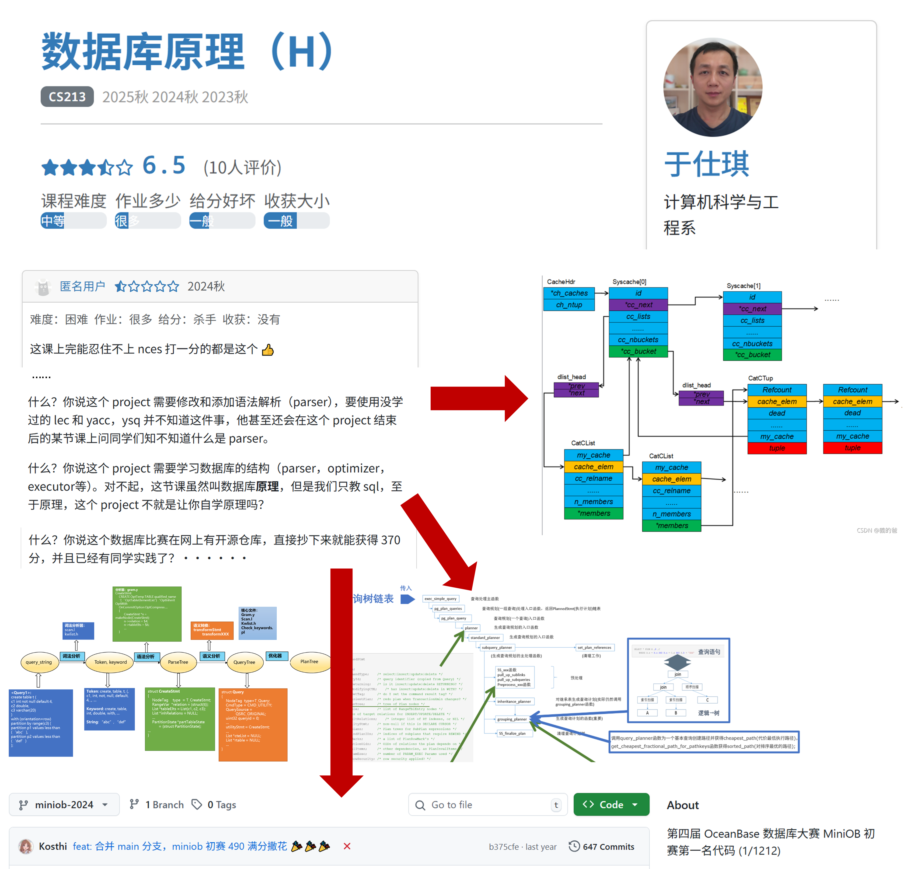


---
## **工作3**：课程增强


- **补充0** 明确添加数据库原理课程模块和资源
- **补充1** 课后阅读: miniob高分代码 [Assginment]
- **补充2** 语法分析树实验 [Lab] (第三周/第十四周)
- **补充3** 查询优化器实验 [Lab] (补充第十三周)
- **补充4** 页存储实验 [Lab] (第十周)
- **补充5** 先行项目:MyCMD [Assignment] (前2-3周)
- **补充6** 课后阅读: PostgreSQL源码设计 [Assignment]
- **补充7** 关于OpenGauss [Lab] (第一周)


---

## **补充0 明确添加数据库原理课程模块和资源**

**[Lecture]** 选讲数据库内核原理仓库——以《PostgresInternals》为例
https://github.com/liuyuanyuan/PostgresInternals/blob/master/ch3.md


## 介绍

  本文档着笔于PostgreSQL内部机制剖析，面向数据库管理员和系统开发人员。
  PostgreSQL是一个开源的多用途的关系数据库系统，在世界范围内得到了广泛使用。这是一个集成多个子系统的庞大系统，每个子系统都具有特定的复杂功能并相互协作。对内部机制的理解，对于使用PostgreSQL进行管理和集成是至关重要的，但是它的庞大和复杂性却会阻碍理解过程。本文档的主要目的是：解释每个子系统的工作机制，并提供PostgreSQL的整体概况。

## 内容

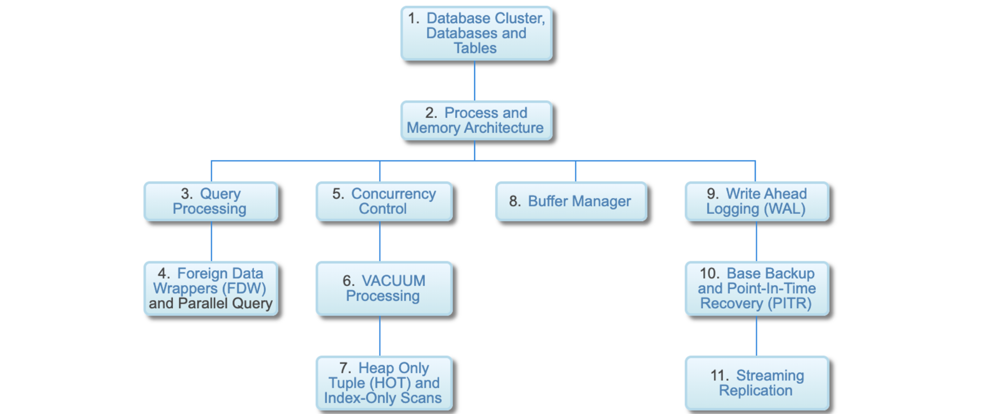

1. [数据库集群、数据库和表](ch1.md) Database Cluster, Databases and Tables
2. [进程和内存架构](ch2.md) Process and Memory Architecture
3. [20%查询处理](ch3.md) Query Processing
4. [外部数据封装器和并行查询](ch4.md) Foreign Data Wrappers (FDW) and Parallel Query
5. [0%并发控制](ch5.md) Concurrency Control
6. [0%VACUUM处理](ch6.md) VACUUM Processing
7. [0%仅堆元组和仅索引扫描](ch7.md) Heap Only Tuple (HOT) and Index-Only Scans
8. [缓冲区管理器](ch8.md) Buffer Manager
9. [30%预写式日志](ch9.md) Write Ahead Logging (WAL)
10. [基础备份和时间点恢复](ch10.md) Base Backup and Point-In-Time Recovery (PITR)
11. [流复制](ch11.md) Streaming Replication


### **[Lecture]** 选讲数据库组成原理——以miniob为例
课上其实有提及数据库组成 但是因为优先理论和设计思路而导致同学没有重视 也没有抓手
尝试拆解miniob的架构设计为几个部分：**交互控制** **算法和优化** **信息存储(见miniob架构图)**


### MiniOB 介绍

[文档](https://oceanbase.github.io/miniob/)
代码配套设计文档和相关代码注释已经生成文档，并通过 GitHub Pages 发布。您可以直接访问：[MiniOB GitHub Pages](https://oceanbase.github.io/miniob/).

快速上手

为了帮助开发者更好地上手并学习 MiniOB，建议阅读以下内容：

1. [MiniOB 框架介绍](https://oceanbase.github.io/miniob/design/miniob-architecture/)
2. [如何编译 MiniOB 源码](https://oceanbase.github.io/miniob/how_to_build/)
3. [如何运行 MiniOB](https://oceanbase.github.io/miniob/how_to_run/)
4. [使用 GitPod 开发 MiniOB](https://oceanbase.github.io/miniob/dev-env/dev_by_gitpod/)
5. [doxygen 代码文档](https://oceanbase.github.io/miniob/design/doxy/html/index.html)

为了帮助大家更好地学习数据库基础知识，OceanBase社区提供了一系列教程。更多文档请参考 [MiniOB GitHub Pages](https://oceanbase.github.io/miniob/)。建议学习：

1. [《从0到1数据库内核实战教程》  视频教程](https://open.oceanbase.com/activities/4921877?id=4921946)
2. [《从0到1数据库内核实战教程》  基础讲义](https://github.com/oceanbase/kernel-quickstart)
3. [《数据库管理系统实现》  华中科技大学实现教材](https://oceanbase.github.io/miniob/lectures/index.html)

系统架构

MiniOB 整体架构如下图所示:
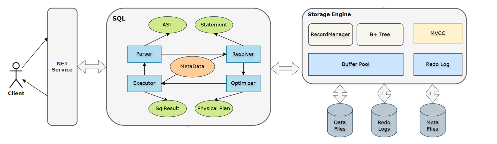

其中:

- 网络模块(NET Service)：负责与客户端交互，收发客户端请求与应答；
- SQL解析(Parser)：将用户输入的SQL语句解析成语法树；
- 语义解析模块(Resolver)：将生成的语法树，转换成数据库内部数据结构；
- 查询优化(Optimizer)：根据一定规则和统计数据，调整/重写语法树。(部分实现)；
- 计划执行(Executor)：根据语法树描述，执行并生成结果；
- 存储引擎(Storage Engine)：负责数据的存储和检索；
- 事务管理(MVCC)：管理事务的提交、回滚、隔离级别等。当前事务管理仅实现了MVCC模式，因此直接以MVCC展示；
- 日志管理(Redo Log)：负责记录数据库操作日志；
- 记录管理(Record Manager)：负责管理某个表数据文件中的记录存放；
- B+ Tree：表索引存储结构；
- 会话管理：管理用户连接、调整某个连接的参数；
- 元数据管理(Meta Data)：记录当前的数据库、表、字段和索引元数据信息；
- 客户端(Client)：作为测试工具，接收用户请求，向服务端发起请求。


#### 课上对于数据库基本结构再三强调 在课程中期补充的深入一些的结构讲解将会解答很多疑问


---

## **补充1** 课后阅读: miniob高分代码 [Assginment]
https://github.com/RushDB-Lab/miniob-RushDB
原PostgreSQL的源代码结构不够清晰
**复杂的架构**聚集在有限的几个代码文件中(正如课上提到 可能受限于开发和版本兼容)


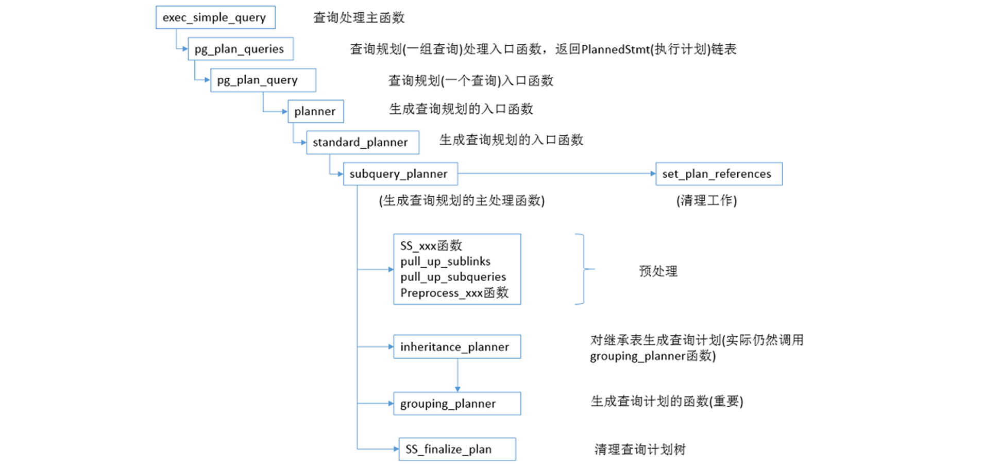

### 相比之下miniob的代码结构清晰且能反应设计思路

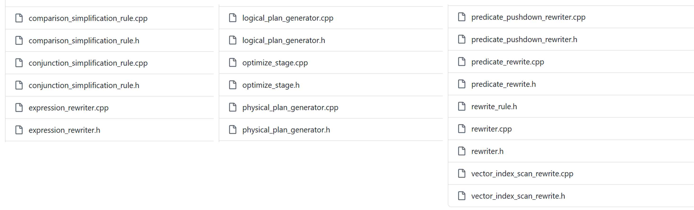
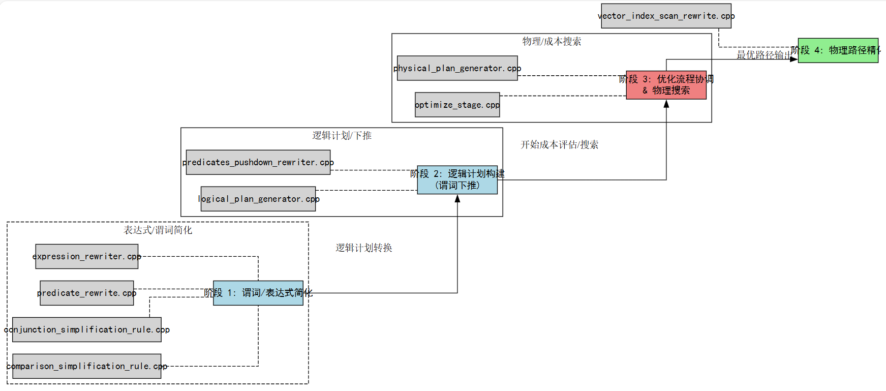

---

## **补充2** 语法分析树实验 [Lab] (第三周/第十四周)
参考部分院校的课件和本课程的Injection Attack Lab 设计了一个语法分析树Lab
由于设计上是从注入攻击入手的 建议补充到注入攻击实验中
直观简单的理论部分
基于Lab3的code and data就可以实现
阅读材料便于学生自学


**Lab文件链接**(基于JupyterNoteBook Graphvizonline实现):
https://github.com/MasenWen/Update-Database/blob/master/SQL_Injection/SQL_Injection/SQL_Injection.md

### **Lab文件内容**(建议**直接看文件**):

**数据库查询处理的结构与理论**

数据库的查询处理流程包含**查询解析**（在查询优化）阶段前。添加的内容简化了这一阶段的树结构(参考清华课件)
1.  **查询解析（Query Parsing）阶段：** 将原始 **SQL 字符串**转换为结构化的表示并产生一棵 **语法分析树 (Parse Tree)**。该树由表示语法结构的**非终端节点**（如 <Where>）和表示数据的 字面量/关键字 构成。
2.  **查询优化阶段：** 接收查询树作为输入，输出**最优的查询执行计划**。

**本实验的目的**是利用简化的**语法分析树** **直观化 SQL 注入攻击**:

* **注入成功：** 不安全的拼接方式导致数据库解析器将恶意输入（如分号、OR）误识别为**结构节点**，从而**插入的篡改**原始查询的**语法分析树**结构。
* **防御机制：** PreparedStatement 确保所有用户输入在语法分析时都被视为一个单一的数据字面量（叶子节点）。

**理论结构图**
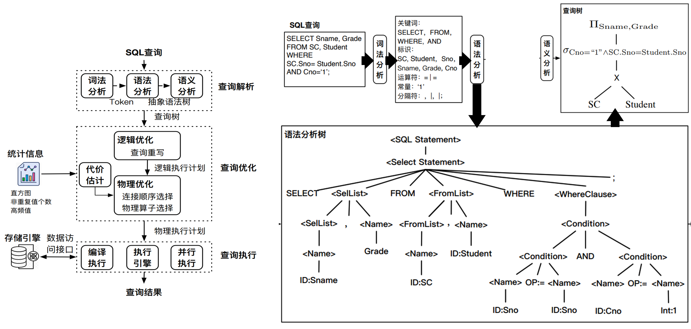

**实验补充的语法分析树图补充**
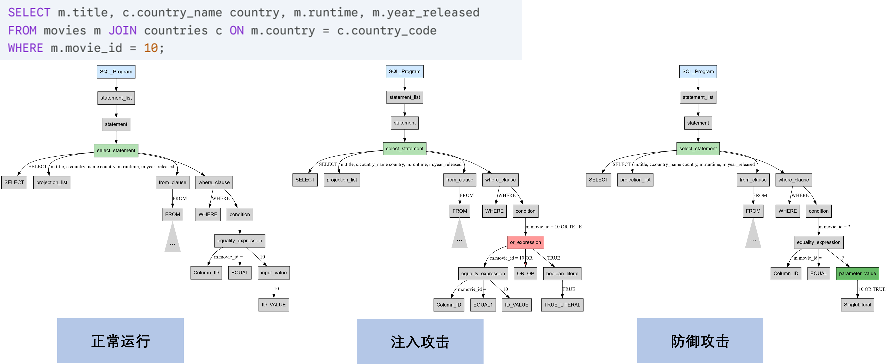

---

## **补充3** 查询优化器实验 [Lab] (补充第十三周)


### 设计了一个查询优化器Lab
* 参考部分院校的课件和本课程的其他Lab 
* 直观简单的理论部分* 和其他Lab一样基于SQL就可以实现
* 阅读材料便于学生自学
* **Lab文件链接**(基于JupyterNoteBook Graphvizonline实现):
* https://github.com/MasenWen/Update-Database/blob/master/SQL_Optimization/SQL_Optimization/SQL_Optimization.md

* **Lab文件内容**(建议**直接看文件**)

#### Lab包含：5个基于SQL EXPLAIN的实验


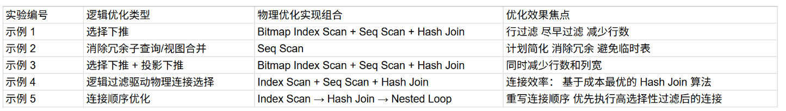

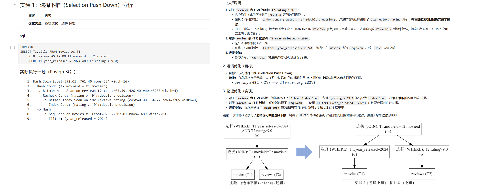


#### 实验中涉及的优化方法总结 (关系代数)

1. 选择 ($\sigma$) 与 选择下推 (Selection Push Down)

* **对应 SQL 操作：** `WHERE` 子句。
* **优化原理：** **选择**用于提取满足条件的行。选择下推是基于关系代数**等价规则**的逻辑优化，它将 $\sigma$ 操作推到连接 ($\bowtie$) 之前，以达到**尽早过滤行**的目的。
* **优化目标：** **减少流入连接阶段的数据量**（行数），提高后续操作的效率。
  
1. 投影 ($\pi$) 与 投影下推 (Projection Push Down)

* **对应 SQL 操作：** `SELECT` 列表中的列。
* **优化原理：** **投影**用于提取指定的列。投影下推将 $\pi$ 操作推到连接 ($\bowtie$) 之前，**只保留需要的列**（包括连接键）。
* **优化目标：** **减少数据流的宽度**，通过剔除不需要的列（特别是巨大的列），节省 I/O 成本和内存消耗。

3. 连接 ($\bowtie$) 与 连接顺序优化 (Join Ordering)

* **对应 SQL 操作：** `JOIN` 子句。
* **优化原理：** **连接**是组合关系的主要操作。连接顺序优化是基于关系代数**结合律**和**交换律**（$\bowtie$）的搜索策略。它不改变最终结果，但通过调整连接顺序来**最小化所有中间结果集**。
* **优化目标：** 目标是确保**优先执行高选择性过滤后的连接**，以实现整体查询效率的最优化。

4. 消除冗余（Subquery Flattening / View Merging）

* **对应 SQL 操作：** 嵌套子查询、视图。
* **优化原理：** 这是一种**逻辑等价规则**，用于消除查询中的冗余结构。它将子查询或视图中的操作（如 $\sigma$ 或 $\pi$）与外部查询的操作**合并**。
* **优化目标：** 目标是消除不必要的**中间操作**（例如不需要的投影或临时表的物化），将复杂结构转化为**平面查询**。


#### 本模块参考资料
* 数据库关系代数
  * [维基百科: 数据库关系代数](https://zh.wikipedia.org/wiki/%E5%85%B3%E7%B3%BB%E4%BB%A3%E6%95%B0_(%E6%95%B0%E6%8D%AE%E5%BA%93))
* PostgrSQL官方文档
  * https://www.postgresql.org/docs/current/runtime-config-query.html
* 其他参考资料
  * https://www.cnblogs.com/cpaulyz/p/14671793.html
  * https://dbgroup.cs.tsinghua.edu.cn/ligl/courses/slides11.pdf


---

## **补充4** 页存储实验 [Lab] (第十周)

参考一些开发者博客和本课程的其他Lab 设计了一个页存储Lab
Storage课程配套Lab TriggerLab可以推移和Trigger课程对齐
直观简单的理论部分
和其他Lab一样基于SQL就可以实现
阅读材料便于学生自学
**Lab文件链接**(基于JupyterNoteBook Graphvizonline实现):
https://github.com/MasenWen/Update-Database/blob/master/Page_Storage/Page_Storage/Page_Storage.md

### **Lab文件内容**(建议**直接看文件**):

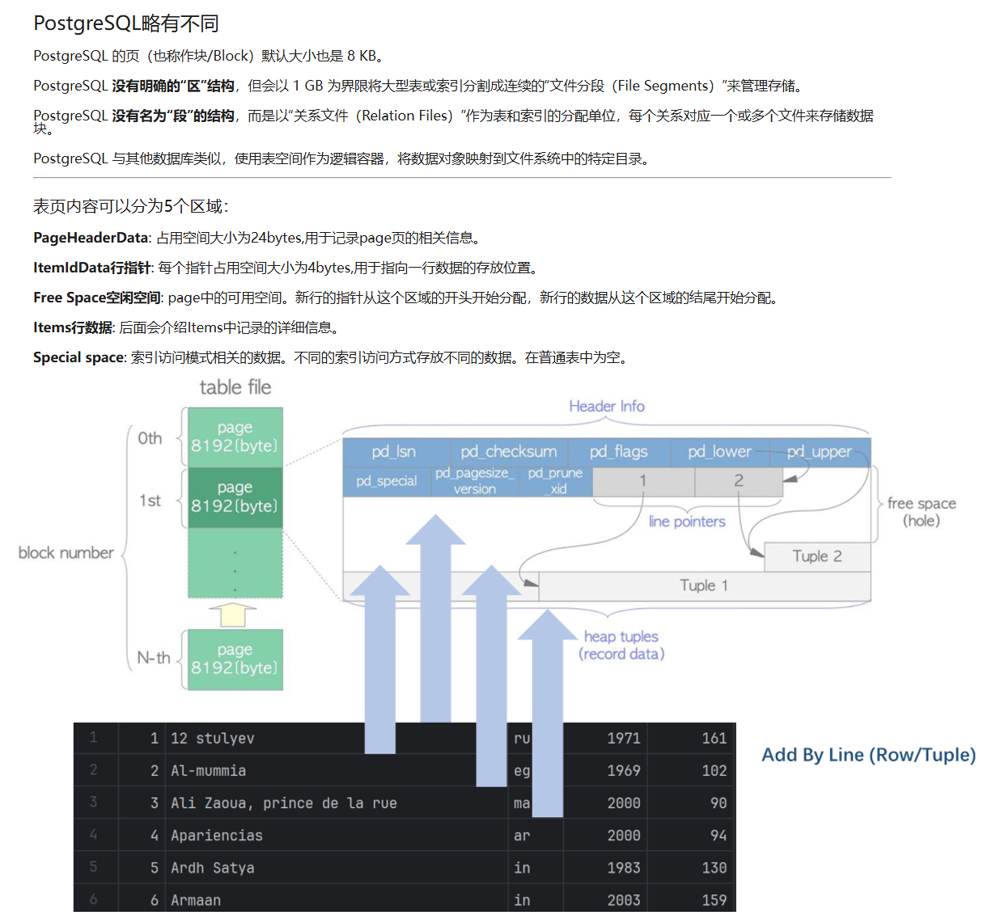

### 5个基于PSQL pageinspect扩展的实验

本模块利用 `pageinspect` 工具，将抽象的“存储原理”转化为可视化的验证过程：

| 实验名称 | 核心原理 | 关键发现与验证内容 |
| :--- | :--- | :--- |
| **Exp 1: 数据的物理坐标** | **CTID 映射** | 验证表非连续存储。通过查询 `CTID`，证实逻辑行被映射为具体的 `(页号, 偏移量)` 物理地址。 |
| **Exp 2: 解剖数据页** | **槽页结构** | 观测 8KB 页面内部布局。验证了“页头/指针向后增长，数据从页尾向前堆放”的高效空间管理机制。 |
| **Exp 3: MVCC 内核机制** | **多版本控制** | 证明 `UPDATE` 本质是“插入新版本 + 标记旧版本”。通过观测事务ID (`xmin`/`xmax`) 变化直观展示版本链。 |
| **Exp 4: 索引物理映射** | **B+树叶节点** | 观测索引页内部。证实索引不存完整数据，仅存 `(Key, CTID)`。CTID 是连接索引与堆表数据的物理指针。 |
| **Exp 5: TOAST 存储** | **行外压缩** | 对比超长字段的极小“物理长度”与巨大“逻辑长度”，验证数据库自动将大对象切片移至 TOAST 表的策略。 |

### 其他参考资料

[关系数据库页存储结构(不以psql讨论)](https://blog.csdn.net/a18020162344/article/details/103462088)
[PostgreSQL内核之数据库集群、数据库、表](https://www.modb.pro/db/1943987071559938048)
[PostgreSQL物理存储结构之表的Page内容分析](https://www.modb.pro/db/244578)
[Postgres存储引擎](https://zhuanlan.zhihu.com/p/622596175?utm_id=0)

---

## **补充5** 先行项目:MyCMD [Assignment] (前2-3周)
对于ParseTree的构造基于ParseTree的查询优化和缓存分配优化和争抢是相对困难的
但简单的基于file的存储 增删改查是很简单的
很巧我自己在学期初写了一个 不用AI需要一周末 使用AI半天即可完成 (我评估了不同AI基于prompt的工作效果 GitHubCopilot Gemini Deepseek都相当好)
这很也接近于**计算机高级程序设计**——于++课程的project4（没有用file而是直接修改本地存储）
同时 这对熟悉数据库连接完成Project1的包装(私以为用代码包装完整实验更为清晰)有很大帮助


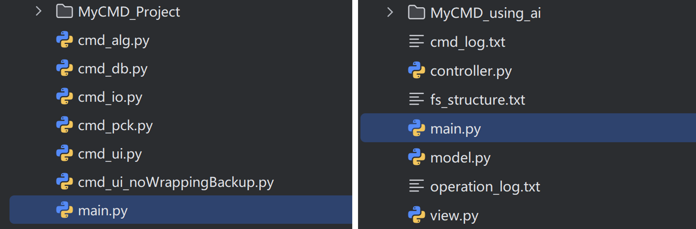


#### 项目要求
* 支持使用命令增删改查 较为简陋的显示支持使用命令增删改查 较为简陋的显示
* 可以涉及如下部分的baseline
  - SQL解析(Parser)：将用户输入的SQL语句解析成语法树；
  - 语义解析模块(Resolver)：将生成的语法树，转换成数据库内部数据结构；
  - 计划执行(Executor)：根据语法树描述，执行并生成结果；
  - 存储引擎(Storage Engine)：负责数据的存储和检索；
  - 事务管理(MVCC)：管理事务的提交、回滚、隔离级别等。当前事务管理仅实现了MVCC模式，因此直接以MVCC展示；
  - 日志管理(Redo Log)：负责记录数据库操作日志；
  - 客户端(Client)：作为测试工具，接收用户请求，向服务端发起请求。
#### 余下的可以结合PostgreSQL官方文件和我在Project1中使用的几篇源码架构分析的博客进行**课后阅读**

---

## **补充6** 课后阅读: PostgreSQL源码设计 [Assignment]
* https://www.postgresql.org/docs/current/overview.html
* https://www.cnblogs.com/flying-tiger/p/6063709.html¶
* https://www.cnblogs.com/flying-tiger/p/8039055.html
* https://cloud.tencent.com/developer/article/2339809

### PostgreSQL源码
* 官方下载地址 https://www.postgresql.org/ftp/source/ 
---

## **补充7 关于OpenGauss [Lab] (第一周)**
鉴于课程决定了添加openGauss的教学 对课程做以下两点补充
### 1.openGauss介绍: 
包括openGauss定位 介绍文件 课程中会涉及的特点 语法特性 与PostgreSQL的不同
 Lab材料链接: https://github.com/MasenWen/Update-Database/blob/master/OpenGauss/OpenGauss/OpenGauss.md
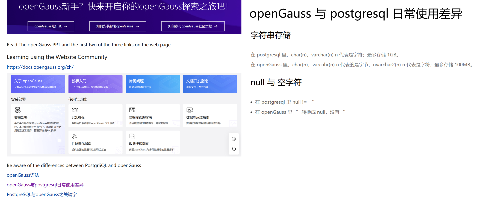


 openGauss基于PostgreSQL但是同时为了迎合Oracle等标准导致了一些差异
 openGauss在type限定上有一些标准差异


```sql
---
---postgresql字符测试
---
postgres=# \d dt
                       Table "public.dt"
 Column |         Type         | Collation | Nullable | Default
--------+----------------------+-----------+----------+---------
 id     | integer              |           |          |
 col1   | character varying(8) |           |          |

postgres=# insert into dt values(3,'中文字符长度测试');
INSERT 0 1
postgres=# insert into dt values(4,'yingwen8');
INSERT 0 1
postgres=# insert into dt values(4,'yingwen88');
ERROR:  value too long for type character varying(8)

---
---openGauss字符测试
---
mydb=# \d+ dt
                                 Table "public.dt"
 Column |         Type         | Modifiers | Storage  | Stats target | Description
--------+----------------------+-----------+----------+--------------+-------------
 id     | integer              |           | plain    |              |
 col1   | character varying(8) |           | extended |              |
 col2   | nvarchar2(8)         |           | extended |              |
Has OIDs: no
Options: orientation=row, compression=no

mydb=# insert into dt(id,col1) values(3,'yingwen8');
INSERT 0 1
mydb=# insert into dt(id,col1) values(3,'yingwen88');
ERROR:  value too long for type character varying(8)
CONTEXT:  referenced column: col1
mydb=# insert into dt(id,col1) values(3,'中文测试');
ERROR:  value too long for type character varying(8)
CONTEXT:  referenced column: col1
mydb=# insert into dt(id,col1) values(3,'中文测');
ERROR:  value too long for type character varying(8)
CONTEXT:  referenced column: col1

mydb=# insert into dt(id,col2) values(4,'中文字符长度测试');
INSERT 0 1
mydb=# insert into dt(id,col2) values(4,'yingwen8');
INSERT 0 1
mydb=# insert into dt(id,col2) values(4,'yingwen88');
ERROR:  value too long for type nvarchar2(8)
CONTEXT:  referenced column: col2
mydb=#
```

openGauss在null的定义上有所不同(通过.sql插入数据时我们提到过)


```sql 
---
---postgresql测试
---
postgres=# create table dt(id int,col1 varchar(8));
CREATE TABLE
postgres=# insert into dt values(1,null);
INSERT 0 1
postgres=# insert into dt values(2,'');
INSERT 0 1
postgres=# select * from dt;
 id | col1
----+------
  1 |
  2 |
(2 rows)

postgres=# select * from dt where col1 is null;
 id | col1
----+------
  1 |
(1 row)

postgres=# select * from dt where col1='';
 id | col1
----+------
  2 |
(1 row)

postgres=#
---
---openGauss测试
---
mydb=# create table dt(id int,col1 varchar(8));
CREATE TABLE
mydb=# insert into dt values(1,null);
INSERT 0 1
mydb=# insert into dt values(1,'');
INSERT 0 1
mydb=# select * from dt;
 id | col1
----+------
  1 |
  1 |
(2 rows)

mydb=# select * from dt where col1 is null;
 id | col1
----+------
  1 |
  1 |
(2 rows)

mydb=# select * from dt where col1='';
 id | col1
----+------
(0 rows)

mydb=#
```


### 2.openGauss安装教程: 
按步骤安装教学 结合AI适应电脑 帮助学生快速安装openGauss 对docker有基本的了解
### 阅读材料链接: [基于openGauss学习Docker](https://opengauss.org/zh/blogs/2022/%E5%9F%BA%E4%BA%8EopenGauss%E5%AD%A6%E4%B9%A0Docker.html)


### Docker 是基于 Go 语言开发的，开源项目
官网： https://www.docker.com/
文档： https://docs.docker.com/
仓库： https://hub.docker.com/


### Lab材料链接: https://github.com/MasenWen/Update-Database/blob/master/OpenGauss_Docker/OpenGauss_Docker/OpenGauss_Docker.md

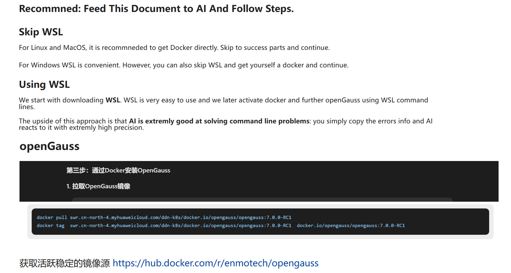

---


