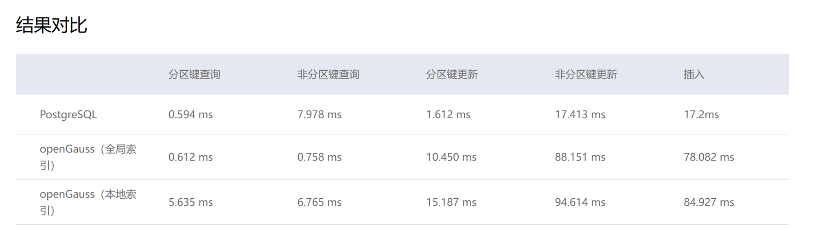

# <p align="center">PDS Project2 Report</p>
# <p align="center">Introduce OpenGauss部分</p>

**<p align="center">Masen Wen</p>**
**<p align="center">2025-12-05</p>**


* 实验代码&实验报告已上传Github
  * https://github.com/MasenWen


---
## 1. Web Page and Introduction PPT

* Web Page
  * https://opengauss.org/zh/
* Read The openGauss PPT and the first two of the three links on the web page.


---
## 2. Install OpenGauss using Docker

* 记录详细过程的Lab Report
  * https://github.com/MasenWen


---
## 3. Learning using the Website Community
* learning resources
  * https://docs.opengauss.org/zh/
  * Be aware of the differences between PostgrSQL and openGauss
  * [openGauss语法](https://docs.opengauss.org/zh/docs/latest/sql_reference/brief_tutorial/syntax.html)
  * [openGauss与postgresql日常使用差异](https://opengauss.org/zh/blogs/gaoyunlong/openGauss%E4%B8%8Epostgresql%E6%97%A5%E5%B8%B8%E4%BD%BF%E7%94%A8%E5%B7%AE%E5%BC%82.html)
  * [PostgreSQL与openGauss之关键字](https://opengauss.org/zh/blogs/gaoyunlong/PostgreSQL%E4%B8%8EopenGauss%E4%B9%8B%E5%85%B3%E9%94%AE%E5%AD%97.html)


```sql
---
---postgresql字符测试
---
postgres=# \d dt
                       Table "public.dt"
 Column |         Type         | Collation | Nullable | Default
--------+----------------------+-----------+----------+---------
 id     | integer              |           |          |
 col1   | character varying(8) |           |          |

postgres=# insert into dt values(3,'中文字符长度测试');
INSERT 0 1
postgres=# insert into dt values(4,'yingwen8');
INSERT 0 1
postgres=# insert into dt values(4,'yingwen88');
ERROR:  value too long for type character varying(8)

---
---openGauss字符测试
---
mydb=# \d+ dt
                                 Table "public.dt"
 Column |         Type         | Modifiers | Storage  | Stats target | Description
--------+----------------------+-----------+----------+--------------+-------------
 id     | integer              |           | plain    |              |
 col1   | character varying(8) |           | extended |              |
 col2   | nvarchar2(8)         |           | extended |              |
Has OIDs: no
Options: orientation=row, compression=no

mydb=# insert into dt(id,col1) values(3,'yingwen8');
INSERT 0 1
mydb=# insert into dt(id,col1) values(3,'yingwen88');
ERROR:  value too long for type character varying(8)
CONTEXT:  referenced column: col1
mydb=# insert into dt(id,col1) values(3,'中文测试');
ERROR:  value too long for type character varying(8)
CONTEXT:  referenced column: col1
mydb=# insert into dt(id,col1) values(3,'中文测');
ERROR:  value too long for type character varying(8)
CONTEXT:  referenced column: col1

mydb=# insert into dt(id,col2) values(4,'中文字符长度测试');
INSERT 0 1
mydb=# insert into dt(id,col2) values(4,'yingwen8');
INSERT 0 1
mydb=# insert into dt(id,col2) values(4,'yingwen88');
ERROR:  value too long for type nvarchar2(8)
CONTEXT:  referenced column: col2
mydb=#
```


```sql
---
---postgresql测试
---
postgres=# create table dt(id int,col1 varchar(8));
CREATE TABLE
postgres=# insert into dt values(1,null);
INSERT 0 1
postgres=# insert into dt values(2,'');
INSERT 0 1
postgres=# select * from dt;
 id | col1
----+------
  1 |
  2 |
(2 rows)

postgres=# select * from dt where col1 is null;
 id | col1
----+------
  1 |
(1 row)

postgres=# select * from dt where col1='';
 id | col1
----+------
  2 |
(1 row)

postgres=#
---
---openGauss测试
---
mydb=# create table dt(id int,col1 varchar(8));
CREATE TABLE
mydb=# insert into dt values(1,null);
INSERT 0 1
mydb=# insert into dt values(1,'');
INSERT 0 1
mydb=# select * from dt;
 id | col1
----+------
  1 |
  1 |
(2 rows)

mydb=# select * from dt where col1 is null;
 id | col1
----+------
  1 |
  1 |
(2 rows)

mydb=# select * from dt where col1='';
 id | col1
----+------
(0 rows)

mydb=#
```

---
## 4. 了解性能差异
  * 在这门课程的范畴下 openGauss的性能优化**几乎得不到任何体现**
  * 但这并不意味着openGauss性能不佳
####



