# <p align="center">PDS Project2 Report</p>
# <p align="center">Page Storage部分</p>

**<p align="center">Masen Wen</p>**
**<p align="center">2025-12-05</p>**


* 实验代码&实验报告已上传Github
  * https://github.com/MasenWen


---
## 1. 实验背景（数据库基本存储结构）

* 接着课上内容展开:


* 数据库记录是按照行来存储的，但是数据库的读取并不以行为单位，在数据库中，不论读一行，还是读多行，都是将这些行所在的页进行加载。
* 也就是说，数据库管理存储空间的基本单位是页(Page)。

---
## 1.1 MySQL InnoDB引擎的存储结构

* **页(Page)** 是用来存储数据表达形式行的空间，一页可以存在多个行。
* 不同数据库对于页的大小定义是不一样的，Sql Server的页大小为8K,Oralce支持的块大小为2KB、4KB、8KB、16KB、32KB 和 64KB。

* **区(Extent)** 是比页大一级的存储结构，在 InnoDB 引擎中，一个区会分配 64 个连续的页，默认大小为 16KB，一个区的大小也就是 1M。

* **段(Segment)** 是由一个区或多个区组成，段并不需要区是连续的，段是数据库的分配单位，创建表的时候会创建一个表段，创建一个索引的时候会创建一个索引段。

* **表空间(Tablespace)** 是一个逻辑容器，表空间是由段或多个段组成，对应的关系是一对多的关系。
* 数据库是由一个表空间或多个表空间组成，从管理上可以划分为系统表空间、用户表空间、临时表空间等。

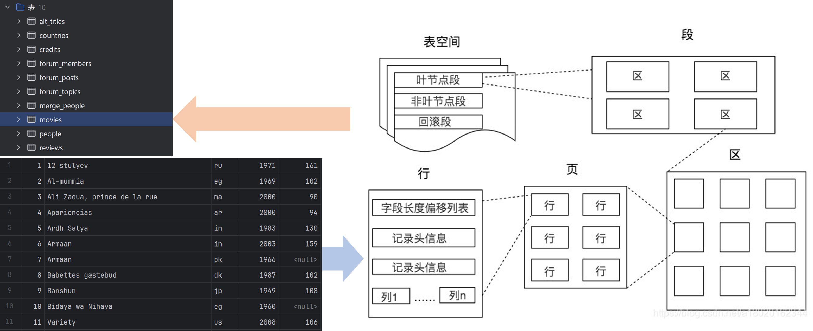


---

## 1.2 PostgreSQL的存储结构

* PostgreSQL的存储结构略有不同
  * PostgreSQL 的页（也称作块/Block）默认大小也是 8 KB。
  * PostgreSQL **没有明确的“区”结构**，但会以 1 GB 为界限将大型表或索引分割成连续的“文件分段（File Segments）”来管理存储。
  * PostgreSQL **没有名为“段”的结构**，而是以“关系文件（Relation Files）”作为表和索引的分配单位，每个关系对应一个或多个文件来存储数据块。
  * PostgreSQL 与其他数据库类似，使用表空间作为逻辑容器，将数据对象映射到文件系统中的特定目录。
* 其中，Page内容可以分为5个区域：
  * **PageHeaderData**: 占用空间大小为24bytes,用于记录page页的相关信息。
  * **ItemIdData行指针**: 每个指针占用空间大小为4bytes,用于指向一行数据的存放位置。
  * **Free Space空闲空间**: page中的可用空间。新行的指针从这个区域的开头开始分配，新行的数据从这个区域的结尾开始分配。
  * **Items行数据**: 后面会介绍Items中记录的详细信息。
  * **Special space**: 索引访问模式相关的数据。不同的索引访问方式存放不同的数据。在普通表中为空。


* PG采用堆文件组织方式，如下图所示
  * 每个文件由固定大小(8KB)的页面构成，新写入的数据以append的形式追加到堆文件末尾。
  * 当页写满时创建一个新页继续写入，每个页由block id唯一标识。
  * 堆文件组织的优势在于写入性能较好，插入数据时不需要进行排序和重组。但查询需要借助索引定位到数据的准确位置。


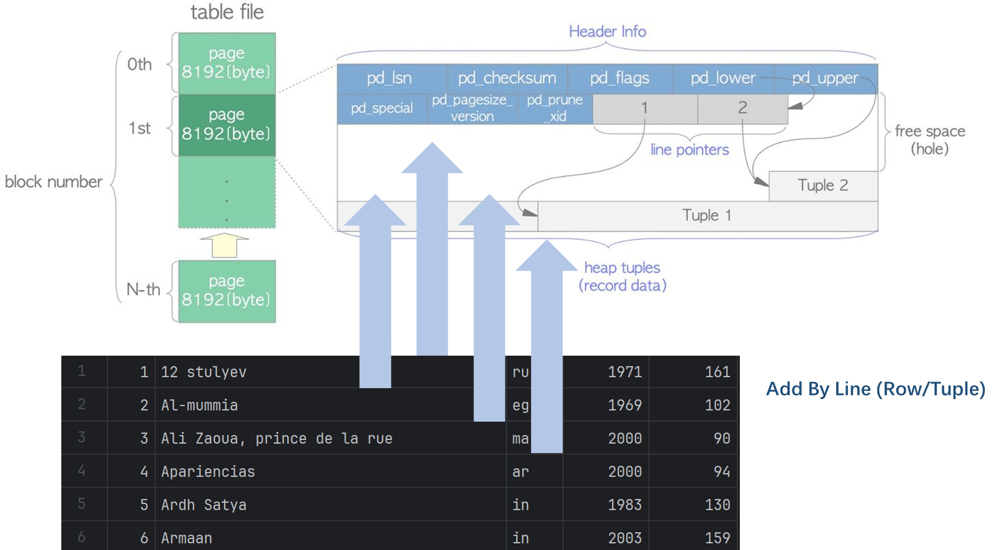

* 这里有两个问题需要解释
  * Q1：为什么指针从前向后存放，而内容行从后向前存放？
  * A1：数据不是定长的，因此无法知道一个页面能容纳多少内容。如果指针和数据同样采取顺序存放，无法计算得到第一个内容行开始的位置。而采用上图中的方式，不会造成空间浪费，指针和内容边界相交就说明页面写满。
  * Q2：为什么是通过索引找到指针，再由指针指向数据？索引中不能直接存放数据的位置吗？
  * A2：PG使用的是逻辑指针方式。索引存放指针id，只要在清理时修改指针的值，无需访问索引。

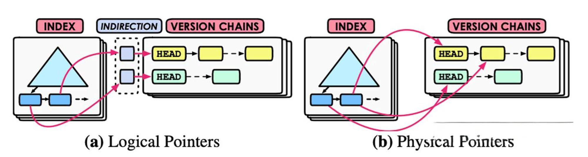

---

## 2. 实验设计
* Experiment 0: pageinspect扩展
* Experiment 1: 数据地址坐标 Physical Coordinate
* Experiment 2: 解剖数据页 (Anatomy of a Page)
* Experiment 3: MVCC 多版本并发控制 (Update Internals)
* Experiment 4: 索引如何找到数据 (Index-to-Heap Mapping)
* Experiment 5: TOAST 大字段存储 (Handling Large Data)


---

## 3. 实验过程


#### **Experiment 0**: pageinspect扩展
* pageinspect 扩展是PostgreSQL提供的一个工具。它允许用户查看数据库内部数据页(page)的原始内容。
* 预备工作 (Prerequisites): 添加pageinspect扩展和创建实验表emp

```sql
-- 1. 安装pageinspect
CREATE EXTENSION IF NOT EXISTS pageinspect;

-- 2. 创建实验表 emp
DROP TABLE IF EXISTS emp;
CREATE TABLE emp (
    id int PRIMARY KEY,
    name varchar(50),
    bio text
);

-- 3. 插入普通数据 (用于 Exp 1-4 观察 Page 内部结构)
INSERT INTO emp VALUES (1, 'Alice', 'Engineer');
INSERT INTO emp VALUES (2, 'Bob',   'Designer');
INSERT INTO emp VALUES (3, 'Tom',   'Manager');

-- 4. 插入超长数据 (专门用于 Exp 5: TOAST)
INSERT INTO emp VALUES (99, 'BigData', repeat('LongBioData-', 1000));
```

---
#### **Experiment 1**: 数据地址坐标 Physical Coordinate
* 数据库通过 CTID (Tuple ID) 定位数据。直觉上我们总认为表是连续的，但实际上表由离散的数据页组成，地址差别可能很大。
* Query (查询): 查询 ID 为 1,2,3 的员工的地址。

```sql
SELECT ctid, id, name
FROM emp
WHERE id < 10;
```

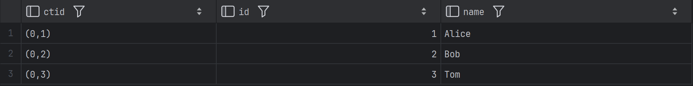

#### Analysis (分析):
* ctid = (0,1) 表示该行数据存储在 第 0 号数据页 (Page 0) 的 第 1 个槽位 (Item 1)。
* 这是存储引擎内部使用的“指针”。索引扫描最终都会转化为对 ctid 的访问。
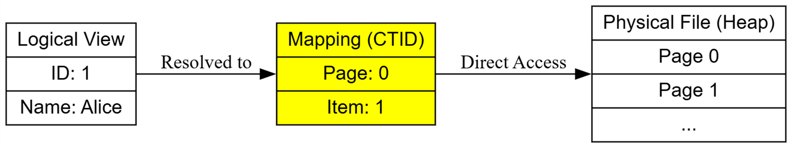


#### 同理我们可以看看movies表中的情况


```sql
SELECT ctid, movieid, title
FROM movies
WHERE title LIKE 'Star Wars%';
```
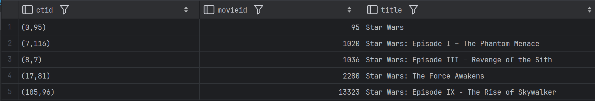

---

#### **Experiment 2**: 解剖数据页 (Anatomy of a Page)
* PostgreSQL 中存在 Slotted Page (槽页) 结构。页头（Header）行指针（Line Pointers）和实际数据（Tuples）按规则布局。
* Query (查询): 读取第 0 页的原始二进制信息，解析第 1 个指针。

```sql
SELECT
    lp as "Item Index",
    lp_off as "Offset",
    lp_len as "Length",
    t_data as "Hex Data"
FROM heap_page_items(get_raw_page('emp', 0))
WHERE lp = 1 or lp = 2 or lp = 3;
```
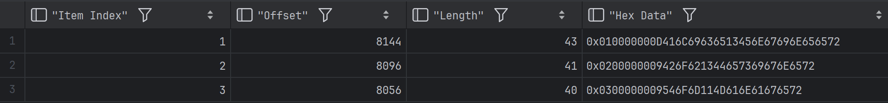

* Offset 8144 接近 8192 说明数据在页尾
* 8192 8096 8056依次减小 说明数据从页尾向前添加


#### Analysis (分析):
* 双向增长：Page Header 和指针数组从页头（0）向后增长，而实际数据（Tuple）从页尾（8192）向前堆放。
* 间接引用：索引指向 Item Index (lp=1)，Item Index 指向 Offset (8160)。这允许数据库在页内移动数据时，无需修改索引。

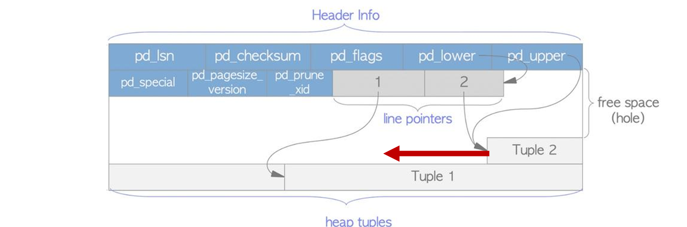


#### 同理
* 我们看到movies表使用的第一个页存储了130行数据
* 最后一个数据的位置在584 因为130个"Item Index"占据了520个空间 再添加一条导致index空间和内容空间重合

```sql
SELECT
    lp as "Item Index",
    lp_off as "Offset",
    lp_len as "Length",
    t_data as "Hex Data"
FROM heap_page_items(get_raw_page('movies', 0));
```


---

#### **Experiment 3**: MVCC 多版本并发控制 (Update Internals)
* Update = Insert + Mark Old. 更新操作并非原地修改，而是创建新版本，并保留旧版本以支持事务回滚和并发读取。
* Query (查询)：更新 Alice 的名字。

```sql
-- Step 1: Update
UPDATE emp SET name = 'Alice_V2' WHERE id = 1;

-- Step 2: Inspect Page 0 again
SELECT lp, t_xmin, t_xmax, t_data 
FROM heap_page_items(get_raw_page('emp', 0));
```
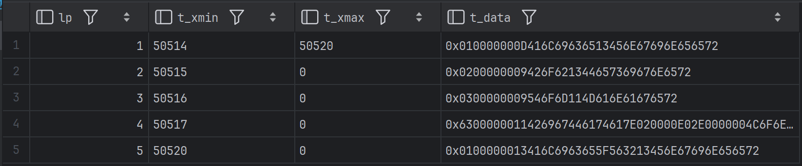


#### Analysis (分析):
* 多出现了一条记录
* lp=1 (旧行): t_xmax 被标记为当前事务ID，表示已“死亡”。
* lp=5 (新行): t_xmin 是当前事务ID，t_xmax 为 0，表示“存活”。
* 回滚(使用了Transaction的前提下)以恢复 lp=1.


---


#### **Experiment 4**: 索引如何找到数据 (Index-to-Heap Mapping)
* 验证 B+ 树叶子节点的内容: 索引不存储完整数据，只存储键值和物理地址。
* Query (查询): 查看主键索引 emp_pkey 的内容。

```sql
-- 这里的 1 代表 root page
SELECT itemoffset, ctid, data 
FROM bt_page_items('emp_pkey', 1);
```


#### Analysis (分析):
* KeyValue 分离：索引页中仅存储了ID的值（如 01 代表 ID=1，63 代表十六进制的 ID=99），完全没有存储 name 或 bio 等其他列的数据。
* ID=1 指向 (0,1)（第0页第1行）。
* ID=99 指向 (0,4)（第0页第4行）。
* 执行WHERE id = 99时，数据库先在B+树中找到63 (Hex)，读取对应的ctid (0,4)，然后直接跳转到Heap Page 0的第4个槽位读取完整数据。
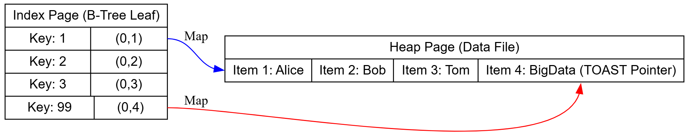

---
#### **Experiment 5**: TOAST 大字段存储 (Handling Large Data)
* 当一行数据超过页大小（8KB）时，数据库进行特殊处理。
* Query (查询): 查看 ID=2 (Bob, 有超长 bio) 的物理存储信息。

```sql
SELECT 
    h.lp as "Item Index", 
    h.lp_len as "Physical Length", 
    length(e.bio) as "Logical Length"
FROM heap_page_items(get_raw_page('emp', 0)) h
JOIN emp e ON e.ctid = ('(0,' || h.lp || ')')::tid
WHERE e.id = 99;
```
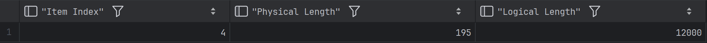


#### Analysis (分析):

* 物理长度 (54 bytes): 这证实了 Heap Page 中并没有存储 10KB 的真实数据。它只存储了一个 TOAST Pointer (指针) 和一些元数据。
* 逻辑长度 (12000 bytes): 数据完整性未受影响，应用层读到的依然是完整数据。
* PostgreSQL 自动将超长字段切片并存储在 pg_toast 系统表中，保证了主表（Heap Page）依然保持紧凑和高效扫描。
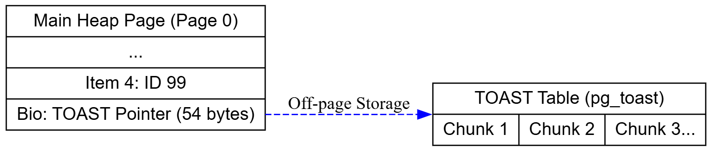

---

## 4. 参考文献
* [关系数据库页存储结构(不以psql讨论)](https://blog.csdn.net/a18020162344/article/details/103462088)
* [PostgreSQL内核之数据库集群、数据库、表](https://www.modb.pro/db/1943987071559938048)
* [PostgreSQL物理存储结构之表的Page内容分析](https://www.modb.pro/db/244578)
* [Postgres存储引擎](https://zhuanlan.zhihu.com/p/622596175?utm_id=0)

