# <p align="center">PDS Project2 Report</p>
# <p align="center">Review & Notes部分</p>

**<p align="center">Masen Wen</p>**
**<p align="center">2025-12-05</p>**


* 实验代码&实验报告已上传Github
  * https://github.com/MasenWen


---
# PPT Week 1
## P3:
教材并没有被重视 或许可以鼓励同学多进行阅读(泛读)
提示同学自行补充一些内容(博客/源码/强调**自行检索能力**)
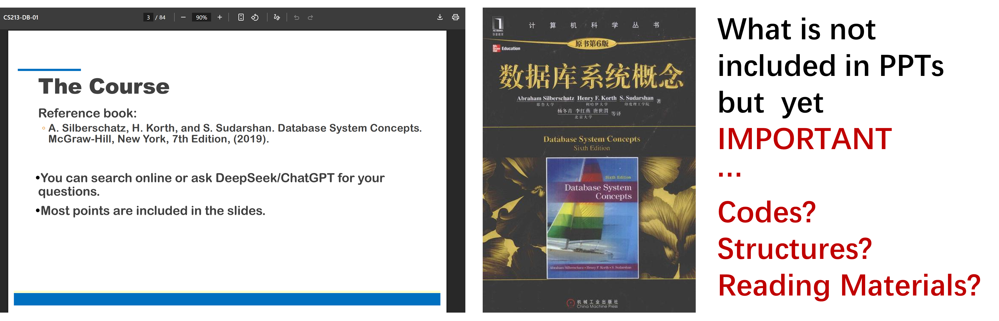

## P21:
对于关系数据库的基本操作可以添加一些内容 有助于后续理解查询优化环节
[维基百科: 关系数据库|关系逻辑](https://zh.wikipedia.org/wiki/%E5%85%B3%E7%B3%BB%E4%BB%A3%E6%95%B0_(%E6%95%B0%E6%8D%AE%E5%BA%93))
添加符号表示 $\sigma$ $\pi$ $\bowtie$ 给出一点表示的例子
可以举一个例子说明如: 先选择再投影和先投影再选择可能有所不同
可以尝试简单一点 给学生们留一个印象
后续论证为何要将整表划分成movies people credits countries也可以加入一些符号的表示
循序渐进 让学生习惯符号化的表示
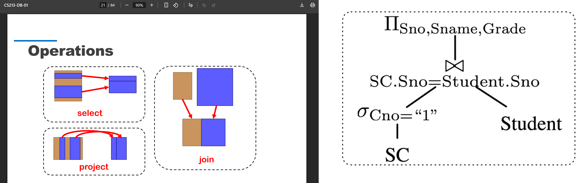

## P62/P65:
更极端的例子
在新数据库的很多数据中(不清洗的话这是一个尤其普遍的情况)同一部电影的不同发行版本会被分给不同国家
存在(美版 日版 国内版) 可能会有**不同的(配音)演员(一般动画会出现这种情况)** runtime(删减)
可以以这个情况为例子 应该怎么处理？ 算不算同一部电影？ ... 既算又不算...


## P74:
这个形式的图是也Postgres官网/openGauss官网介绍文档非常喜欢用的 起初不太容易看懂
Transaction Lab里面的同类表格也很让人头疼
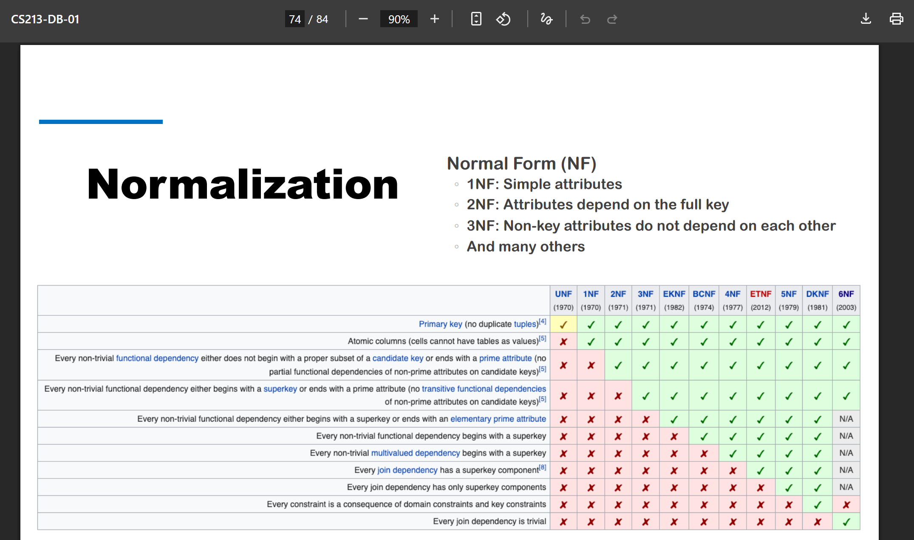


---
# PPT Week 2
## P4/P6:
再次强调关系逻辑的重要性
SQL相对于ALPHA依赖关系逻辑的原始表达更少 自然语言成分更多
联系SELECT FROM WHERE JOIN等和关系逻辑的对应关系
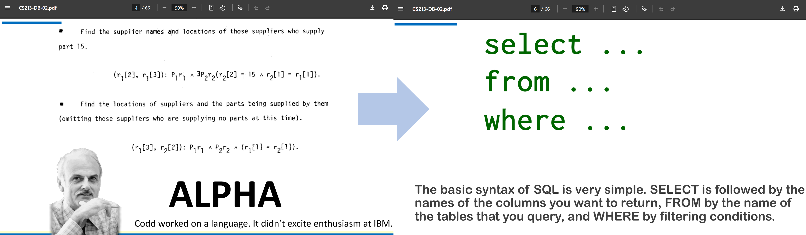

## P17:
本课程的PPT是包括了所有SQL系列语言的 这或许没有必要 建议聚焦PSQL
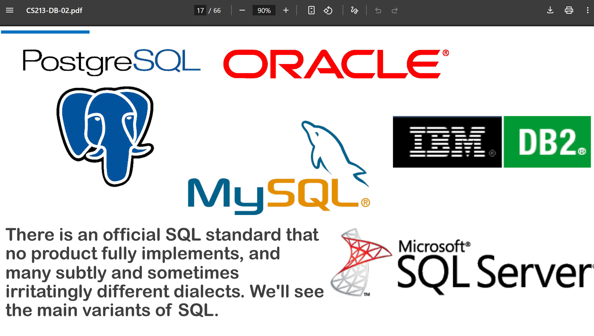

## P27-P34:
在这里**提及openGauss和PostgreSQL的语法细节区别**(建议在第一节课Lab一并安装openGauss 见我做的教程)
openGauss和PostgreSQL的语法细节集中在数据类型
建议课堂演示Project报告中提供的两段代码
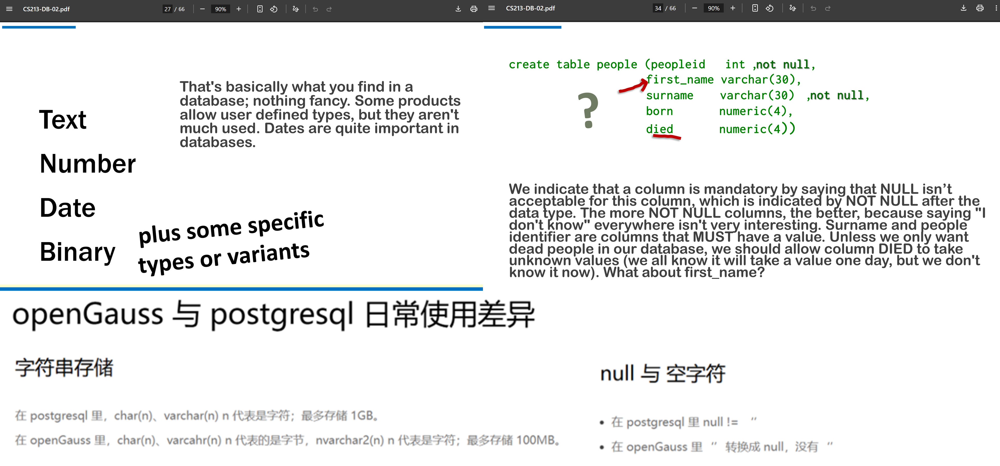


```sql
---
---postgresql字符测试
---
postgres=# \d dt
                       Table "public.dt"
 Column |         Type         | Collation | Nullable | Default
--------+----------------------+-----------+----------+---------
 id     | integer              |           |          |
 col1   | character varying(8) |           |          |

postgres=# insert into dt values(3,'中文字符长度测试');
INSERT 0 1
postgres=# insert into dt values(4,'yingwen8');
INSERT 0 1
postgres=# insert into dt values(4,'yingwen88');
ERROR:  value too long for type character varying(8)

---
---openGauss字符测试
---
mydb=# \d+ dt
                                 Table "public.dt"
 Column |         Type         | Modifiers | Storage  | Stats target | Description
--------+----------------------+-----------+----------+--------------+-------------
 id     | integer              |           | plain    |              |
 col1   | character varying(8) |           | extended |              |
 col2   | nvarchar2(8)         |           | extended |              |
Has OIDs: no
Options: orientation=row, compression=no

mydb=# insert into dt(id,col1) values(3,'yingwen8');
INSERT 0 1
mydb=# insert into dt(id,col1) values(3,'yingwen88');
ERROR:  value too long for type character varying(8)
CONTEXT:  referenced column: col1
mydb=# insert into dt(id,col1) values(3,'中文测试');
ERROR:  value too long for type character varying(8)
CONTEXT:  referenced column: col1
mydb=# insert into dt(id,col1) values(3,'中文测');
ERROR:  value too long for type character varying(8)
CONTEXT:  referenced column: col1

mydb=# insert into dt(id,col2) values(4,'中文字符长度测试');
INSERT 0 1
mydb=# insert into dt(id,col2) values(4,'yingwen8');
INSERT 0 1
mydb=# insert into dt(id,col2) values(4,'yingwen88');
ERROR:  value too long for type nvarchar2(8)
CONTEXT:  referenced column: col2
mydb=#
```


```sql
---
---postgresql测试
---
postgres=# create table dt(id int,col1 varchar(8));
CREATE TABLE
postgres=# insert into dt values(1,null);
INSERT 0 1
postgres=# insert into dt values(2,'');
INSERT 0 1
postgres=# select * from dt;
 id | col1
----+------
  1 |
  2 |
(2 rows)

postgres=# select * from dt where col1 is null;
 id | col1
----+------
  1 |
(1 row)

postgres=# select * from dt where col1='';
 id | col1
----+------
  2 |
(1 row)

postgres=#
---
---openGauss测试
---
mydb=# create table dt(id int,col1 varchar(8));
CREATE TABLE
mydb=# insert into dt values(1,null);
INSERT 0 1
mydb=# insert into dt values(1,'');
INSERT 0 1
mydb=# select * from dt;
 id | col1
----+------
  1 |
  1 |
(2 rows)

mydb=# select * from dt where col1 is null;
 id | col1
----+------
  1 |
  1 |
(2 rows)

mydb=# select * from dt where col1='';
 id | col1
----+------
(0 rows)

mydb=#
```

第二个也可以在constraints处提 因为违反的是not null contraints

## P63:
openGauss也在这里产生状况
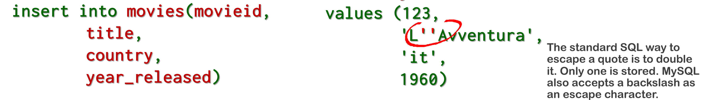


---
# PPT Week 3
## P6/P10:
这里可以再次强调 一个是选择运算 一个是投影运算
这里选择运算是削减行 投影运算是削减列
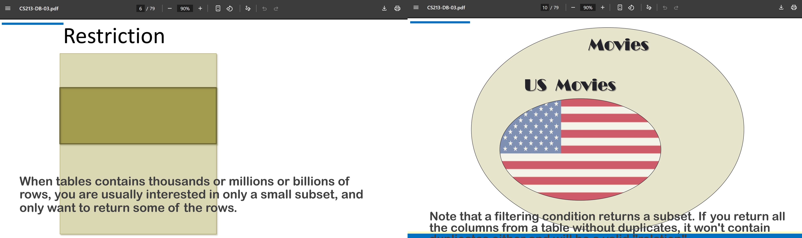

## P11/P13:
这是课上典型的查询优化器例子
利用选择 投影 连接等运算的上推下推简单讲解查询优化器(详细内容见我做的相关Lab)


## P27/P63:
同理 结合查询优化器可以很好的讲解这部分内容
建议画一棵树并指出瓶颈(函数)节点破坏了整棵树的运行性能
说明为什么\<WHERE CLAUSE\>的第一个接入节点会造成性能瓶颈而=(或其他判别符)后的接入节点不会
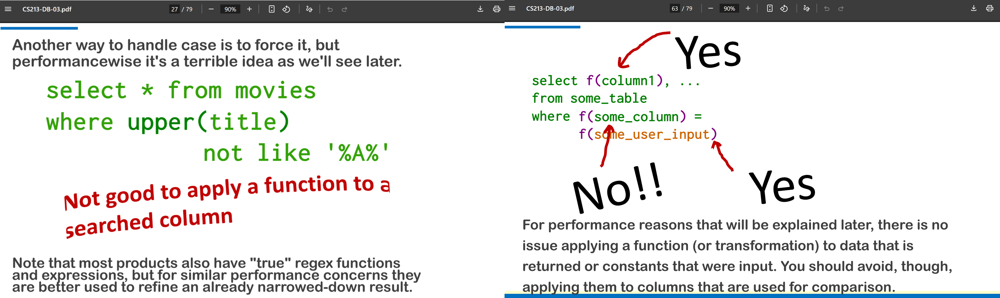

## P65/P66:
提供英文全称+中文翻译 加深印象
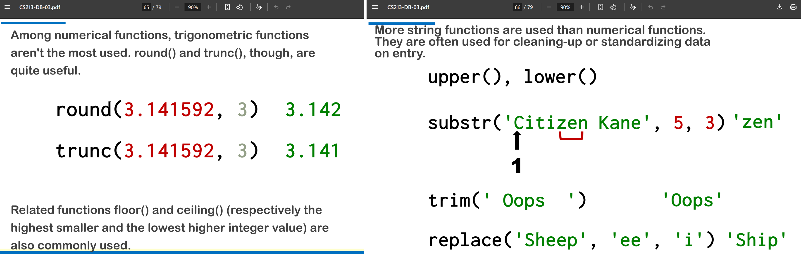


---
# PPT Week 4
## P7:
从性能角度(结合关系代数)分析
DISTINCT是一个开销较大的操作 相当于对经过选择（WHERE）和投影（SELECT）筛选后的结果集进行全量去重
数据库通常通过**Θ(nlogn)排序**（将重复行聚集）或哈希聚合（通过哈希表追踪唯一值）来实现 这需要**Θ(n)遍历**
幸运的是DISTINCT处理的是筛选后的数据 所以可以通过优化筛选来提升效率
## P16:
聚合函数可以用类似的方式分析 强调**Θ(n)遍历**对性能的一般性损害
对于Group By 强调**Θ(nlogn)排序**比**Θ(n)遍历**更加损害性能
在我问问题的时候 老师告诉我:"复杂度不适合衡量数据库因为数据库的影响因素过于复杂了"
这对于这些分析是否适用呢？ 这个内容应该被课程**专门提及**(鉴于DSAA和DM都强调复杂度作为衡量性能的标准)
应该是仍然适用的(见PPT P20)
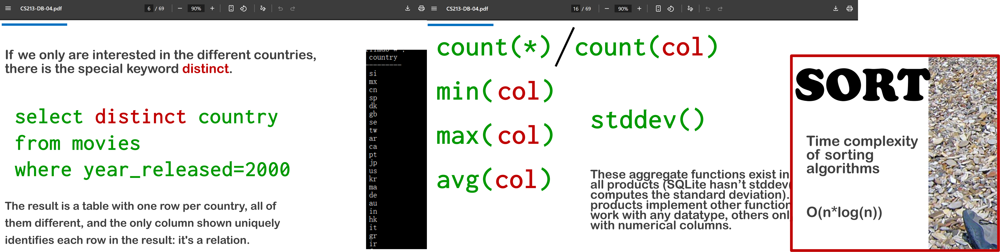

## P19/P21:
having同样可以用关系代数分析可以转化为WHERE的情况
分析having到WHERE的上推过程 分析为什么涉及了聚合函数的having不能转化为WHERE

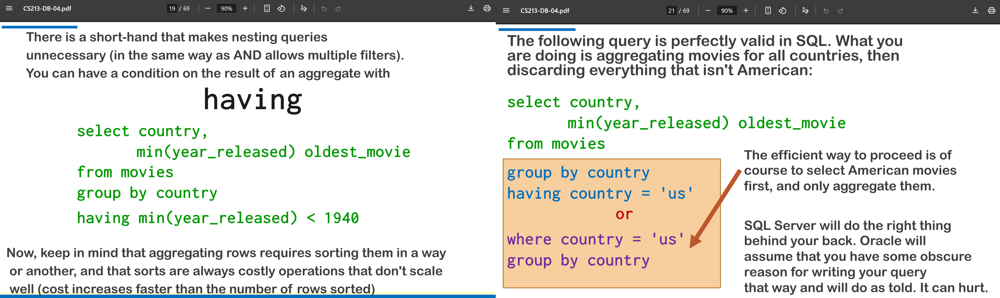

## P43/P45:
**关于JOIN**
课上强调了JOIN的效率远远高于遍历
一个直接的论据就是JOIN是关系代数中的基本类型 $\bowtie$ 而关系代数中几种基本运算是非常高效的
另一个要关注的点是JOIN在查询优化中也是基本的 有多种join_...()方法 这是对于Project1的一点提示
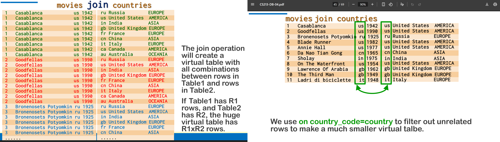

---
# PPT Week 5
## P30:
关于InnerJoin→OuterJoin的这部分内容 初次听有理解困难 或许可以耐心一点
## P31-P52:
对集合运算添加时间复杂度 集合运算的复杂度普遍较高( Θ(N) - Θ(NlogN) ) 好在集合运算一般是最后进行的
###
UNION 用于返回两个子查询结果的并集 它自动执行去重 其复杂度为 $O(N \log N)$
必须对全部 $N$ 行数据进行排序或哈希操作 消除重复元组 因此UNION是一个高成本的操作 性能开销与DISTINCT相似
###
UNION ALL 不去重 为线性时间 $O(N)$ 只需将两个结果集简单拼接在一起
###
INTERSECT 取交集 复杂度通常为 $O(N \log N)$ 了找出共同的元组 通常通过排序或使用哈希
###
EXCEPT 返回存在于第一个结果集但不存在于第二个结果集中的元组 复杂度也通常是 $O(N \log N)$

---
# PPT Week 6
## P11:
经查openGauss使用的也是Postgres标准(很疑惑在什么时候它会选择Oracle)
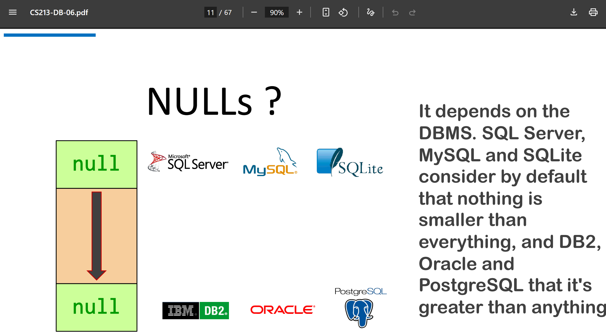
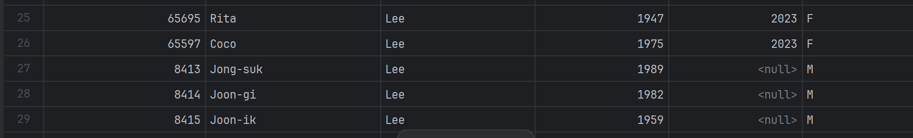
## P18:
应当说明这样的case when then是高效操作 尽管需要遍历 但附带的复杂度是低IO的O(1)
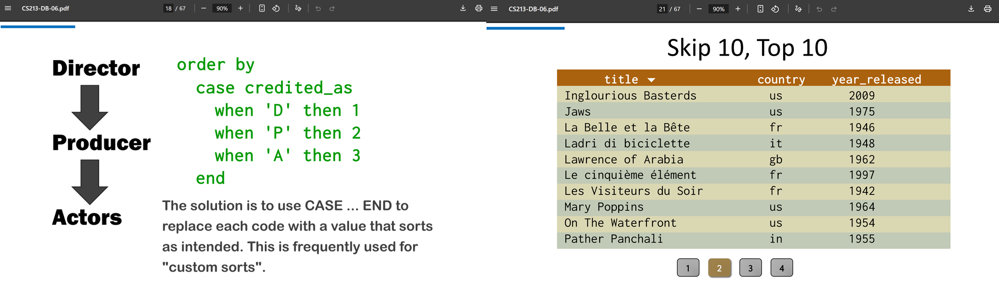
## P21:
关于课上提及的不同页的存储成本不同 在这里提及存储页是可以被读取到不同区域的
页的概念还会在后续Storage&Optimization(页存储)和Transaction(脏页)提到 最好能互相联系起来

## P36:
尝试用复杂度描述(单个操作的成本可能比复杂度更重要 但是复杂度可以帮助理解)
窗口函数保留原始行并执行聚合或排名计算 通常具有 **$O(N \log N)$** 的复杂度 来源于**分区**和**排序**过程
窗口函数依赖在 PARTITION BY 和 ORDER BY 涉及的列上创建**索引**
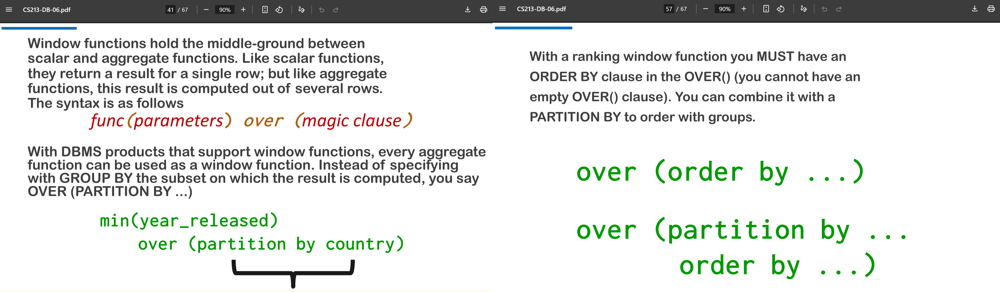

---
# PPT Week 7
## P24:
强化 Transaction是如何在页上操作添加修改记录(见我强化的Lab Storage)
Lab的Isolation Level不太容易懂 可以添加一些示意图/中文版本
[材料内容依赖Postgres的官方文档](https://blog.csdn.net/qq_73683016/article/details/147561062)
[图片来源](https://zhuanlan.zhihu.com/p/422513076)
[图片来源](https://zhuanlan.zhihu.com/p/422511672)
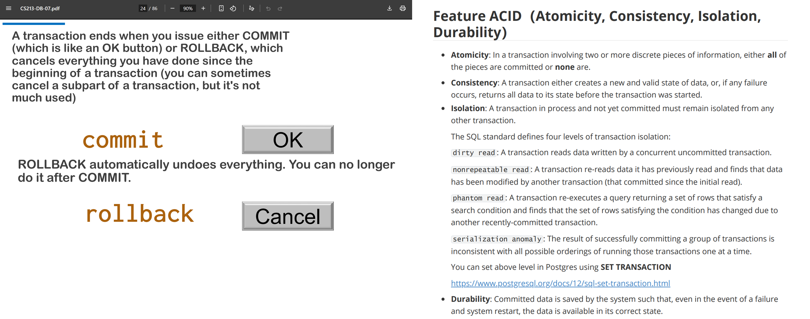
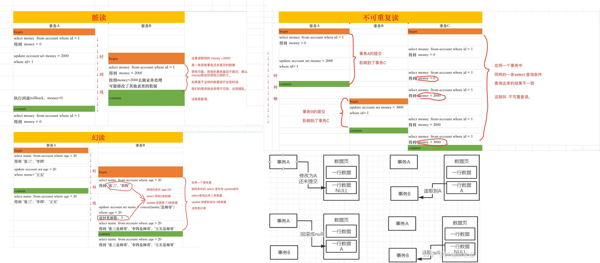

## P38:
同样可以从页存储的角度说明这一点(或许应该讲到后面再提？)

## P43-P46:
强调sequence在高并发中的性能优势(openGauss的优势在于高并发 但是并没有讲过很多此类场景(刷新是一个例子))
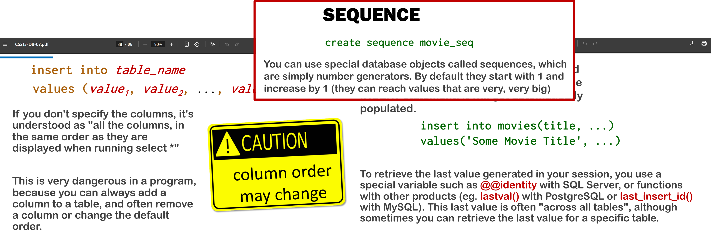
## P70:
相比于各种数据库的导入 在使用DataGrip导入时的注意事项更有实用价值
如: 调整缓存大小以导入大文件 设定列头不当导致的报错 使用插件导入标准\copy无法处理的情况 导出不同形式的数据
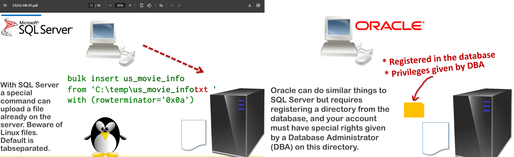

---
# PPT Week 8
## P38/P39:
使用CASCADE可以实现级联更新和删除 也是强大且危险的 AI使用它会造成麻烦 提醒学生注意
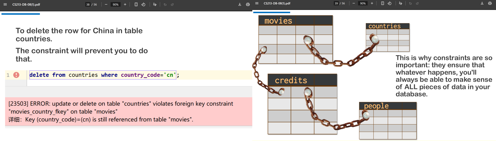

## P47/P54:
创建函数的语法最开始不易理解(我没听懂) 或许可以慢一点 先举一个缺乏意义但简单的例子(如SELECTmovieBYtitle)
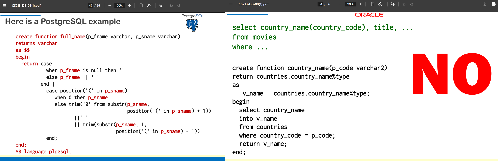

---
# PPT Week 9
## P5/P8:
由于这时候还没有讲系统表 这个内容是不容易理解的 或许可以在讲系统表recap一下
一个很好的例子(源于smoothen python书籍)是说明大多数的封装的目的是防止误触而非禁止 就像开关的盖子而非锁
这在后续课程的view封装修改中也得到了体现:
对于权限不足的修改内容允许编写trigger进行全局操作 这个操作是被记录的 这相当于当众翻开了盖子
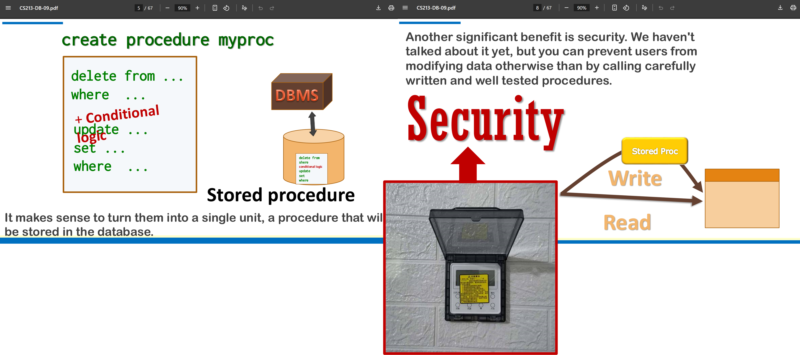

## P11/P12:
Statement的开销源于client和server的连接 这在Project1中很容易被忽略 可以在Lab1测试数据库连接时提及
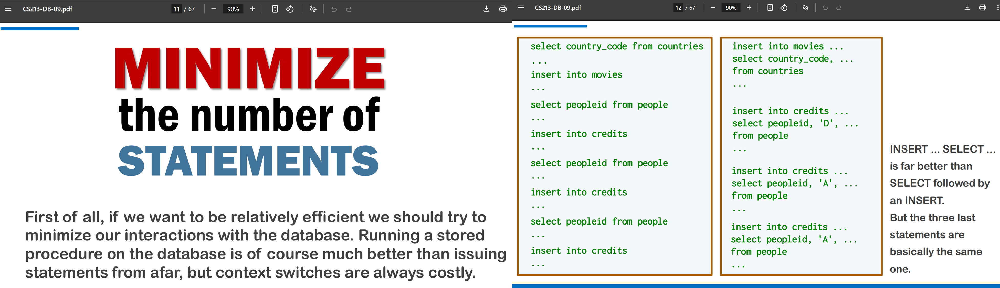

## P23/P24:
我在课上询问关于Trigger和EventListen的区别
一个核心的区别是Trigger相当于原操作的附带操作 如果有问题是会一起回滚的
故而Trigger应该只负责必不可分的整体操作 而Event(假设使用Java调取PSQL)负责其他的反应
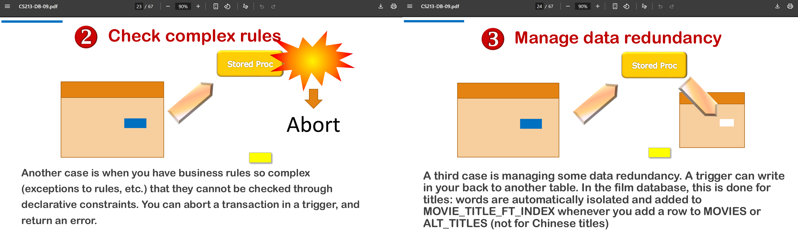

## P40:
尽管课上已经讲的很清楚 但第一次接触仍然造成了困惑 或许可以添加示意图来类比: 检查的时间<=>检查的对象和目的
任何一个步骤检查不通过都会导致回滚 并被记录 （任何足球中的冲突都会导致被判罚 赛前赛中赛后的检查标注不同）
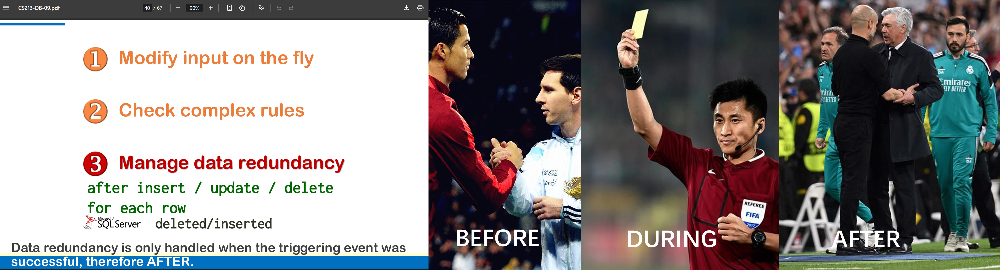

---
# Week 10
## P23:
关于存储 一定有必要从早期开始讲起吗？(我记得这节课没讲完)
注意到PPT将对于存储重要的层级划分/存储空间优化/页存等内容穿插在早期存储模式中 这容易让学生忽略其重要性
或许应该直接从数据库server的存储结构讲起 不要拓展太多
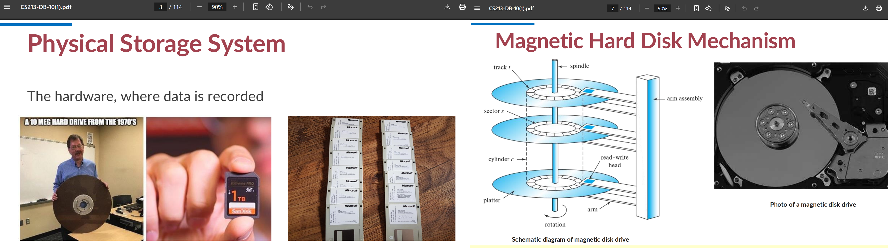

## P23-P35:
这部分可以结合更多的Lab/演示 很多性能上的表现都可以通过测试得到(我想很少同学在Project1里考虑这部分内容)
我补充的Storage Lab里有几个简单的小实验 但更多内容(如下图关于顺序的实验)需要补充
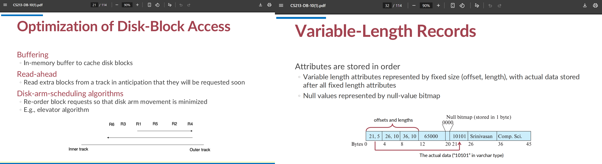

## P36:
索引的内容也可以增加一部分测试
关于查询优化器对于(是否)使用索引的物理优化是一个我很想听的内容 (我没有搞懂所以我没有在查询优化Lab里添加)
关于country code分类的例子讲的很清楚 可以多补充一些这部分的实验/演示
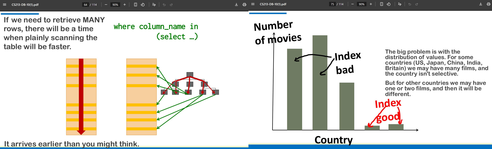

## P76:
查询优化是这门课程最需要补充的内容 这四张插图里损失的内容令人心碎
我将相关内容全部添加到了 查询优化Lab 当中 请**务必**结合关系代数 查询树 索引选择的物理优化 进行精讲
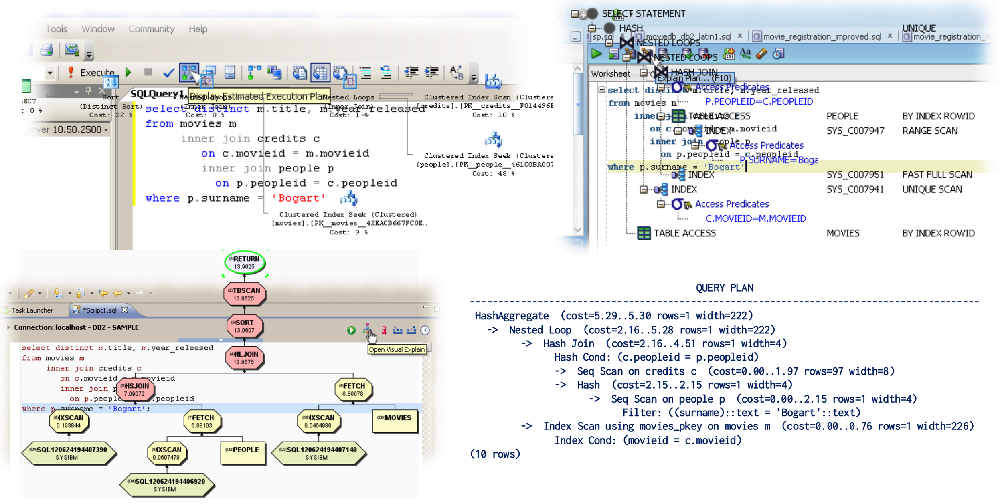


---
# Week 11
## P12/P24:
结合理想状态(假设view的逻辑都可以被优化)下的优化思路 这里第一个例子是下推
第二个例子是调用打包函数(对于view也会有类似情况)不能根据函数内部查询结构进行优化
组织了优化的核心问题是查询树在调用函数/一些view时是扁平的 只调用一层节点 优化需要的树结构化简被限制在外
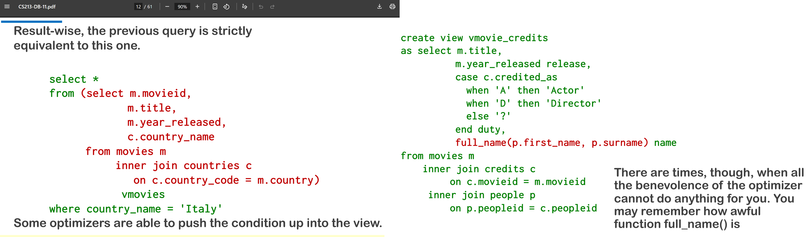

## P39/P40:
一个关于openGauss让同学初次接触感到不解的点是其安全特殊要求
openGauss包含了很完整的日志 用户管理和密码管理
为什么不能用su用户操作？
为什么会大小写转换并大小写敏感(逆天)
...
老师可以利用自己的经验解答 或者下次openGauss的人找了问问为什么会有这样的(逆天)设计
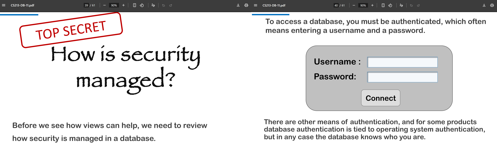

---
# Week 12
## P9:
这是我特别喜欢的形式 **测试**+**报告信息**
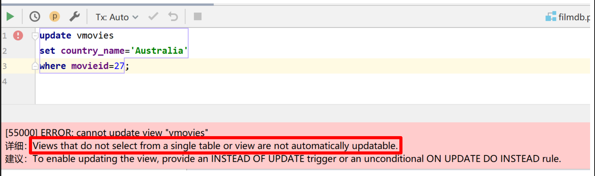

## P25/P26:
Postgres的Synopsis远不如实际的语句来的易懂 建议添加一个例子
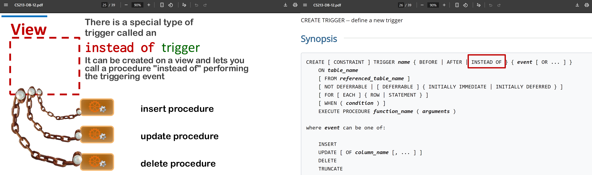

## P34:
在学习Lab之前 这部分内容是模糊不清的 因为不知道系统表和其他view都包括哪些表
学习Lab时情况并没有完全改善 因为没有涉及完整的分类 学生对内容概况可能不了解
我建议添加这样的查询和分类帮助理解


```sql
-- 创建分类视图
CREATE OR REPLACE VIEW system_tables_by_category AS
SELECT
    table_name,
    CASE
        WHEN table_name LIKE 'pg_stat%' THEN '统计信息表'
        WHEN table_name LIKE 'pg_auth%' OR table_name IN ('pg_roles', 'pg_user', 'pg_group') THEN '权限角色表'
        WHEN table_name LIKE 'pg_class' OR table_name LIKE 'pg_attribute' OR table_name LIKE 'pg_index%' THEN '对象定义表'
        WHEN table_name LIKE 'pg_proc' OR table_name LIKE 'pg_language' OR table_name LIKE 'pg_aggregate' THEN '函数语言表'
        WHEN table_name LIKE 'pg_database' OR table_name LIKE 'pg_tablespace' OR table_name LIKE 'pg_sh%' THEN '集群级表'
        WHEN table_name LIKE 'pg_constraint' OR table_name LIKE 'pg_trigger' OR table_name LIKE 'pg_rule' THEN '约束规则表'
        WHEN table_name LIKE 'pg_type' OR table_name LIKE 'pg_enum' OR table_name LIKE 'pg_range' THEN '数据类型表'
        ELSE '其他系统表'
    END as category,
    table_schema
FROM information_schema.tables
WHERE table_schema IN ('pg_catalog', 'information_schema')
ORDER BY category, table_schema, table_name;

-- 查询分类视图
SELECT category, table_schema, table_name
FROM system_tables_by_category
ORDER BY category, table_schema, table_name;

-- 统计每个类别的表数量
SELECT category, COUNT(*) as table_count
FROM system_tables_by_category
GROUP BY category
ORDER BY table_count DESC;
```


```sql
其他系统表,138
统计信息表,49
集群级表,7
权限角色表,5
对象定义表,4
数据类型表,3
函数语言表,3
约束规则表,2
```


```sql
对象定义表,pg_catalog,pg_attribute
对象定义表,pg_catalog,pg_class
对象定义表,pg_catalog,pg_index
对象定义表,pg_catalog,pg_indexes
函数语言表,pg_catalog,pg_aggregate
函数语言表,pg_catalog,pg_language
函数语言表,pg_catalog,pg_proc
集群级表,pg_catalog,pg_database
集群级表,pg_catalog,pg_shadow
集群级表,pg_catalog,pg_shdepend
集群级表,pg_catalog,pg_shdescription
集群级表,pg_catalog,pg_shmem_allocations
集群级表,pg_catalog,pg_shseclabel
集群级表,pg_catalog,pg_tablespace
其他系统表,information_schema,_pg_foreign_data_wrappers
其他系统表,information_schema,_pg_foreign_servers
其他系统表,information_schema,_pg_foreign_table_columns
其他系统表,information_schema,_pg_foreign_tables
其他系统表,information_schema,_pg_user_mappings
其他系统表,information_schema,administrable_role_authorizations
其他系统表,information_schema,applicable_roles
其他系统表,information_schema,attributes
其他系统表,information_schema,character_sets
其他系统表,information_schema,check_constraint_routine_usage
其他系统表,information_schema,check_constraints
其他系统表,information_schema,collation_character_set_applicability
其他系统表,information_schema,collations
其他系统表,information_schema,column_column_usage
其他系统表,information_schema,column_domain_usage
其他系统表,information_schema,column_options
其他系统表,information_schema,column_privileges
其他系统表,information_schema,column_udt_usage
其他系统表,information_schema,columns
其他系统表,information_schema,constraint_column_usage
其他系统表,information_schema,constraint_table_usage
其他系统表,information_schema,data_type_privileges
其他系统表,information_schema,domain_constraints
其他系统表,information_schema,domain_udt_usage
其他系统表,information_schema,domains
其他系统表,information_schema,element_types
其他系统表,information_schema,enabled_roles
其他系统表,information_schema,foreign_data_wrapper_options
其他系统表,information_schema,foreign_data_wrappers
其他系统表,information_schema,foreign_server_options
其他系统表,information_schema,foreign_servers
其他系统表,information_schema,foreign_table_options
其他系统表,information_schema,foreign_tables
其他系统表,information_schema,information_schema_catalog_name
其他系统表,information_schema,key_column_usage
其他系统表,information_schema,parameters
其他系统表,information_schema,referential_constraints
其他系统表,information_schema,role_column_grants
其他系统表,information_schema,role_routine_grants
其他系统表,information_schema,role_table_grants
其他系统表,information_schema,role_udt_grants
其他系统表,information_schema,role_usage_grants
其他系统表,information_schema,routine_column_usage
其他系统表,information_schema,routine_privileges
其他系统表,information_schema,routine_routine_usage
其他系统表,information_schema,routine_sequence_usage
其他系统表,information_schema,routine_table_usage
其他系统表,information_schema,routines
其他系统表,information_schema,schemata
其他系统表,information_schema,sequences
其他系统表,information_schema,sql_features
其他系统表,information_schema,sql_implementation_info
其他系统表,information_schema,sql_parts
其他系统表,information_schema,sql_sizing
其他系统表,information_schema,table_constraints
其他系统表,information_schema,table_privileges
其他系统表,information_schema,tables
其他系统表,information_schema,transforms
其他系统表,information_schema,triggered_update_columns
其他系统表,information_schema,triggers
其他系统表,information_schema,udt_privileges
其他系统表,information_schema,usage_privileges
其他系统表,information_schema,user_defined_types
其他系统表,information_schema,user_mapping_options
其他系统表,information_schema,user_mappings
其他系统表,information_schema,view_column_usage
其他系统表,information_schema,view_routine_usage
其他系统表,information_schema,view_table_usage
其他系统表,information_schema,views
其他系统表,pg_catalog,pg_am
其他系统表,pg_catalog,pg_amop
其他系统表,pg_catalog,pg_amproc
其他系统表,pg_catalog,pg_attrdef
其他系统表,pg_catalog,pg_available_extension_versions
其他系统表,pg_catalog,pg_available_extensions
其他系统表,pg_catalog,pg_backend_memory_contexts
其他系统表,pg_catalog,pg_cast
其他系统表,pg_catalog,pg_collation
其他系统表,pg_catalog,pg_config
其他系统表,pg_catalog,pg_conversion
其他系统表,pg_catalog,pg_cursors
其他系统表,pg_catalog,pg_db_role_setting
其他系统表,pg_catalog,pg_default_acl
其他系统表,pg_catalog,pg_depend
其他系统表,pg_catalog,pg_description
其他系统表,pg_catalog,pg_event_trigger
其他系统表,pg_catalog,pg_extension
其他系统表,pg_catalog,pg_file_settings
其他系统表,pg_catalog,pg_foreign_data_wrapper
其他系统表,pg_catalog,pg_foreign_server
其他系统表,pg_catalog,pg_foreign_table
其他系统表,pg_catalog,pg_hba_file_rules
其他系统表,pg_catalog,pg_ident_file_mappings
其他系统表,pg_catalog,pg_inherits
其他系统表,pg_catalog,pg_init_privs
其他系统表,pg_catalog,pg_largeobject
其他系统表,pg_catalog,pg_largeobject_metadata
其他系统表,pg_catalog,pg_locks
其他系统表,pg_catalog,pg_matviews
其他系统表,pg_catalog,pg_namespace
其他系统表,pg_catalog,pg_opclass
其他系统表,pg_catalog,pg_operator
其他系统表,pg_catalog,pg_opfamily
其他系统表,pg_catalog,pg_parameter_acl
其他系统表,pg_catalog,pg_partitioned_table
其他系统表,pg_catalog,pg_policies
其他系统表,pg_catalog,pg_policy
其他系统表,pg_catalog,pg_prepared_statements
其他系统表,pg_catalog,pg_prepared_xacts
其他系统表,pg_catalog,pg_publication
其他系统表,pg_catalog,pg_publication_namespace
其他系统表,pg_catalog,pg_publication_rel
其他系统表,pg_catalog,pg_publication_tables
其他系统表,pg_catalog,pg_replication_origin
其他系统表,pg_catalog,pg_replication_origin_status
其他系统表,pg_catalog,pg_replication_slots
其他系统表,pg_catalog,pg_rewrite
其他系统表,pg_catalog,pg_rules
其他系统表,pg_catalog,pg_seclabel
其他系统表,pg_catalog,pg_seclabels
其他系统表,pg_catalog,pg_sequence
其他系统表,pg_catalog,pg_sequences
其他系统表,pg_catalog,pg_settings
其他系统表,pg_catalog,pg_subscription
其他系统表,pg_catalog,pg_subscription_rel
其他系统表,pg_catalog,pg_tables
其他系统表,pg_catalog,pg_timezone_abbrevs
其他系统表,pg_catalog,pg_timezone_names
其他系统表,pg_catalog,pg_transform
其他系统表,pg_catalog,pg_ts_config
其他系统表,pg_catalog,pg_ts_config_map
其他系统表,pg_catalog,pg_ts_dict
其他系统表,pg_catalog,pg_ts_parser
其他系统表,pg_catalog,pg_ts_template
其他系统表,pg_catalog,pg_user_mapping
其他系统表,pg_catalog,pg_user_mappings
其他系统表,pg_catalog,pg_views
其他系统表,pg_catalog,pg_wait_events
权限角色表,pg_catalog,pg_auth_members
权限角色表,pg_catalog,pg_authid
权限角色表,pg_catalog,pg_group
权限角色表,pg_catalog,pg_roles
权限角色表,pg_catalog,pg_user
数据类型表,pg_catalog,pg_enum
数据类型表,pg_catalog,pg_range
数据类型表,pg_catalog,pg_type
统计信息表,pg_catalog,pg_stat_activity
统计信息表,pg_catalog,pg_stat_all_indexes
统计信息表,pg_catalog,pg_stat_all_tables
统计信息表,pg_catalog,pg_stat_archiver
统计信息表,pg_catalog,pg_stat_bgwriter
统计信息表,pg_catalog,pg_stat_checkpointer
统计信息表,pg_catalog,pg_stat_database
统计信息表,pg_catalog,pg_stat_database_conflicts
统计信息表,pg_catalog,pg_stat_gssapi
统计信息表,pg_catalog,pg_stat_io
统计信息表,pg_catalog,pg_stat_progress_analyze
统计信息表,pg_catalog,pg_stat_progress_basebackup
统计信息表,pg_catalog,pg_stat_progress_cluster
统计信息表,pg_catalog,pg_stat_progress_copy
统计信息表,pg_catalog,pg_stat_progress_create_index
统计信息表,pg_catalog,pg_stat_progress_vacuum
统计信息表,pg_catalog,pg_stat_recovery_prefetch
统计信息表,pg_catalog,pg_stat_replication
统计信息表,pg_catalog,pg_stat_replication_slots
统计信息表,pg_catalog,pg_stat_slru
统计信息表,pg_catalog,pg_stat_ssl
统计信息表,pg_catalog,pg_stat_subscription
统计信息表,pg_catalog,pg_stat_subscription_stats
统计信息表,pg_catalog,pg_stat_sys_indexes
统计信息表,pg_catalog,pg_stat_sys_tables
统计信息表,pg_catalog,pg_stat_user_functions
统计信息表,pg_catalog,pg_stat_user_indexes
统计信息表,pg_catalog,pg_stat_user_tables
统计信息表,pg_catalog,pg_stat_wal
统计信息表,pg_catalog,pg_stat_wal_receiver
统计信息表,pg_catalog,pg_stat_xact_all_tables
统计信息表,pg_catalog,pg_stat_xact_sys_tables
统计信息表,pg_catalog,pg_stat_xact_user_functions
统计信息表,pg_catalog,pg_stat_xact_user_tables
统计信息表,pg_catalog,pg_statio_all_indexes
统计信息表,pg_catalog,pg_statio_all_sequences
统计信息表,pg_catalog,pg_statio_all_tables
统计信息表,pg_catalog,pg_statio_sys_indexes
统计信息表,pg_catalog,pg_statio_sys_sequences
统计信息表,pg_catalog,pg_statio_sys_tables
统计信息表,pg_catalog,pg_statio_user_indexes
统计信息表,pg_catalog,pg_statio_user_sequences
统计信息表,pg_catalog,pg_statio_user_tables
统计信息表,pg_catalog,pg_statistic
统计信息表,pg_catalog,pg_statistic_ext
统计信息表,pg_catalog,pg_statistic_ext_data
统计信息表,pg_catalog,pg_stats
统计信息表,pg_catalog,pg_stats_ext
统计信息表,pg_catalog,pg_stats_ext_exprs
约束规则表,pg_catalog,pg_constraint
约束规则表,pg_catalog,pg_trigger
```

进而对系统表进行分类


```sql
-- 详细功能分类查询
SELECT
    pc.relname as table_name,
    CASE
        -- 对象定义和存储
        WHEN pc.relname IN ('pg_class', 'pg_attribute') THEN '对象存储结构'
        WHEN pc.relname IN ('pg_index', 'pg_constraint', 'pg_trigger') THEN '对象辅助结构'
        WHEN pc.relname IN ('pg_type', 'pg_enum', 'pg_range') THEN '数据类型定义'

        -- 权限和安全
        WHEN pc.relname IN ('pg_authid', 'pg_auth_members') THEN '认证核心表'
        WHEN pc.relname IN ('pg_roles', 'pg_user', 'pg_group') THEN '认证视图'
        WHEN pc.relname IN ('pg_shdepend', 'pg_shdescription') THEN '共享对象依赖'

        -- 数据库集群
        WHEN pc.relname IN ('pg_database', 'pg_tablespace') THEN '集群级对象'
        WHEN pc.relname IN ('pg_db_role_setting', 'pg_default_acl') THEN '集群级设置'

        -- 函数和语言
        WHEN pc.relname IN ('pg_proc', 'pg_language') THEN '函数定义'
        WHEN pc.relname IN ('pg_aggregate', 'pg_operator') THEN '操作符/聚合'

        -- 统计信息
        WHEN pc.relname LIKE 'pg_stat%' AND pc.relname NOT LIKE '%io%' THEN '活动统计'
        WHEN pc.relname LIKE 'pg_stat%io%' THEN 'IO统计'
        WHEN pc.relname = 'pg_statistic' THEN '优化器统计'

        -- 查询优化
        WHEN pc.relname IN ('pg_opclass', 'pg_am', 'pg_amop') THEN '访问方法'
        WHEN pc.relname IN ('pg_rewrite', 'pg_rules') THEN '规则系统'

        -- 扩展和插件
        WHEN pc.relname IN ('pg_extension', 'pg_foreign_table') THEN '扩展管理'

        -- 其他核心
        WHEN pc.relname IN ('pg_description', 'pg_seclabel') THEN '注释和标签'
        WHEN pc.relname IN ('pg_depend', 'pg_shdepend') THEN '对象依赖'
        WHEN pc.relname IN ('pg_conversion', 'pg_collation') THEN '字符集/排序'

        ELSE '其他系统表'
    END as detailed_category,

    -- 添加访问频率指示
    CASE
        WHEN pc.relname IN ('pg_class', 'pg_attribute', 'pg_index', 'pg_constraint')
            THEN '高频访问(DDL/DML)'
        WHEN pc.relname IN ('pg_stat_user_tables', 'pg_stat_all_tables')
            THEN '监控常用'
        WHEN pc.relname IN ('pg_authid', 'pg_roles')
            THEN '认证时访问'
        WHEN pc.relname LIKE 'pg_catalog.pg_%'
            THEN '系统内部'
        ELSE '按需访问'
    END as access_frequency,

    -- 表大小和类型
    pg_size_pretty(pg_total_relation_size(pc.oid)) as total_size,
    CASE pc.relkind
        WHEN 'r' THEN '普通表'
        WHEN 'i' THEN '索引'
        WHEN 'S' THEN '序列'
        WHEN 'v' THEN '视图'
        WHEN 'c' THEN '复合类型'
        ELSE '其他'
    END as relation_type

FROM pg_class pc
JOIN pg_namespace pn ON pn.oid = pc.relnamespace
WHERE pn.nspname = 'pg_catalog'
AND pc.relkind IN ('r', 'v')  -- 只包括表和视图
ORDER BY detailed_category, table_name;
```


```sql
pg_stat_io,IO统计,按需访问,0 bytes,视图
pg_stat_replication,IO统计,按需访问,0 bytes,视图
pg_stat_replication_slots,IO统计,按需访问,0 bytes,视图
pg_stat_subscription,IO统计,按需访问,0 bytes,视图
pg_stat_subscription_stats,IO统计,按需访问,0 bytes,视图
pg_stat_user_functions,IO统计,按需访问,0 bytes,视图
pg_stat_xact_user_functions,IO统计,按需访问,0 bytes,视图
pg_statio_all_indexes,IO统计,按需访问,0 bytes,视图
pg_statio_all_sequences,IO统计,按需访问,0 bytes,视图
pg_statio_all_tables,IO统计,按需访问,0 bytes,视图
pg_statio_sys_indexes,IO统计,按需访问,0 bytes,视图
pg_statio_sys_sequences,IO统计,按需访问,0 bytes,视图
pg_statio_sys_tables,IO统计,按需访问,0 bytes,视图
pg_statio_user_indexes,IO统计,按需访问,0 bytes,视图
pg_statio_user_sequences,IO统计,按需访问,0 bytes,视图
pg_statio_user_tables,IO统计,按需访问,0 bytes,视图
pg_aggregate,操作符/聚合,按需访问,72 kB,普通表
pg_operator,操作符/聚合,按需访问,232 kB,普通表
pg_attribute,对象存储结构,高频访问(DDL/DML),864 kB,普通表
pg_class,对象存储结构,高频访问(DDL/DML),248 kB,普通表
pg_constraint,对象辅助结构,高频访问(DDL/DML),224 kB,普通表
pg_index,对象辅助结构,高频访问(DDL/DML),104 kB,普通表
pg_trigger,对象辅助结构,按需访问,104 kB,普通表
pg_depend,对象依赖,按需访问,376 kB,普通表
pg_am,访问方法,按需访问,72 kB,普通表
pg_amop,访问方法,按需访问,224 kB,普通表
pg_opclass,访问方法,按需访问,88 kB,普通表
pg_shdepend,共享对象依赖,按需访问,40 kB,普通表
pg_shdescription,共享对象依赖,按需访问,64 kB,普通表
pg_rewrite,规则系统,按需访问,736 kB,普通表
pg_rules,规则系统,按需访问,0 bytes,视图
pg_language,函数定义,按需访问,80 kB,普通表
pg_proc,函数定义,按需访问,1240 kB,普通表
pg_stat_activity,活动统计,按需访问,0 bytes,视图
pg_stat_all_indexes,活动统计,按需访问,0 bytes,视图
pg_stat_all_tables,活动统计,监控常用,0 bytes,视图
pg_stat_archiver,活动统计,按需访问,0 bytes,视图
pg_stat_bgwriter,活动统计,按需访问,0 bytes,视图
pg_stat_checkpointer,活动统计,按需访问,0 bytes,视图
pg_stat_database,活动统计,按需访问,0 bytes,视图
pg_stat_database_conflicts,活动统计,按需访问,0 bytes,视图
pg_stat_gssapi,活动统计,按需访问,0 bytes,视图
pg_stat_progress_analyze,活动统计,按需访问,0 bytes,视图
pg_stat_progress_basebackup,活动统计,按需访问,0 bytes,视图
pg_stat_progress_cluster,活动统计,按需访问,0 bytes,视图
pg_stat_progress_copy,活动统计,按需访问,0 bytes,视图
pg_stat_progress_create_index,活动统计,按需访问,0 bytes,视图
pg_stat_progress_vacuum,活动统计,按需访问,0 bytes,视图
pg_stat_recovery_prefetch,活动统计,按需访问,0 bytes,视图
pg_stat_slru,活动统计,按需访问,0 bytes,视图
pg_stat_ssl,活动统计,按需访问,0 bytes,视图
pg_stat_sys_indexes,活动统计,按需访问,0 bytes,视图
pg_stat_sys_tables,活动统计,按需访问,0 bytes,视图
pg_stat_user_indexes,活动统计,按需访问,0 bytes,视图
pg_stat_user_tables,活动统计,监控常用,0 bytes,视图
pg_stat_wal,活动统计,按需访问,0 bytes,视图
pg_stat_wal_receiver,活动统计,按需访问,0 bytes,视图
pg_stat_xact_all_tables,活动统计,按需访问,0 bytes,视图
pg_stat_xact_sys_tables,活动统计,按需访问,0 bytes,视图
pg_stat_xact_user_tables,活动统计,按需访问,0 bytes,视图
pg_statistic,活动统计,按需访问,584 kB,普通表
pg_statistic_ext,活动统计,按需访问,32 kB,普通表
pg_statistic_ext_data,活动统计,按需访问,16 kB,普通表
pg_stats,活动统计,按需访问,0 bytes,视图
pg_stats_ext,活动统计,按需访问,0 bytes,视图
pg_stats_ext_exprs,活动统计,按需访问,0 bytes,视图
pg_database,集群级对象,按需访问,80 kB,普通表
pg_tablespace,集群级对象,按需访问,80 kB,普通表
pg_db_role_setting,集群级设置,按需访问,16 kB,普通表
pg_default_acl,集群级设置,按需访问,24 kB,普通表
pg_extension,扩展管理,按需访问,80 kB,普通表
pg_foreign_table,扩展管理,按需访问,16 kB,普通表
pg_amproc,其他系统表,按需访问,144 kB,普通表
pg_attrdef,其他系统表,按需访问,48 kB,普通表
pg_available_extension_versions,其他系统表,按需访问,0 bytes,视图
pg_available_extensions,其他系统表,按需访问,0 bytes,视图
pg_backend_memory_contexts,其他系统表,按需访问,0 bytes,视图
pg_cast,其他系统表,按需访问,80 kB,普通表
pg_config,其他系统表,按需访问,0 bytes,视图
pg_cursors,其他系统表,按需访问,0 bytes,视图
pg_event_trigger,其他系统表,按需访问,48 kB,普通表
pg_file_settings,其他系统表,按需访问,0 bytes,视图
pg_foreign_data_wrapper,其他系统表,按需访问,24 kB,普通表
pg_foreign_server,其他系统表,按需访问,24 kB,普通表
pg_hba_file_rules,其他系统表,按需访问,0 bytes,视图
pg_ident_file_mappings,其他系统表,按需访问,0 bytes,视图
pg_indexes,其他系统表,按需访问,0 bytes,视图
pg_inherits,其他系统表,按需访问,16 kB,普通表
pg_init_privs,其他系统表,按需访问,80 kB,普通表
pg_largeobject,其他系统表,按需访问,8192 bytes,普通表
pg_largeobject_metadata,其他系统表,按需访问,8192 bytes,普通表
pg_locks,其他系统表,按需访问,0 bytes,视图
pg_matviews,其他系统表,按需访问,0 bytes,视图
pg_namespace,其他系统表,按需访问,80 kB,普通表
pg_opfamily,其他系统表,按需访问,80 kB,普通表
pg_parameter_acl,其他系统表,按需访问,24 kB,普通表
pg_partitioned_table,其他系统表,按需访问,16 kB,普通表
pg_policies,其他系统表,按需访问,0 bytes,视图
pg_policy,其他系统表,按需访问,24 kB,普通表
pg_prepared_statements,其他系统表,按需访问,0 bytes,视图
pg_prepared_xacts,其他系统表,按需访问,0 bytes,视图
pg_publication,其他系统表,按需访问,16 kB,普通表
pg_publication_namespace,其他系统表,按需访问,16 kB,普通表
pg_publication_rel,其他系统表,按需访问,32 kB,普通表
pg_publication_tables,其他系统表,按需访问,0 bytes,视图
pg_replication_origin,其他系统表,按需访问,24 kB,普通表
pg_replication_origin_status,其他系统表,按需访问,0 bytes,视图
pg_replication_slots,其他系统表,按需访问,0 bytes,视图
pg_seclabels,其他系统表,按需访问,0 bytes,视图
pg_sequence,其他系统表,按需访问,24 kB,普通表
pg_sequences,其他系统表,按需访问,0 bytes,视图
pg_settings,其他系统表,按需访问,0 bytes,视图
pg_shadow,其他系统表,按需访问,0 bytes,视图
pg_shmem_allocations,其他系统表,按需访问,0 bytes,视图
pg_shseclabel,其他系统表,按需访问,16 kB,普通表
pg_subscription,其他系统表,按需访问,24 kB,普通表
pg_subscription_rel,其他系统表,按需访问,8192 bytes,普通表
pg_tables,其他系统表,按需访问,0 bytes,视图
pg_timezone_abbrevs,其他系统表,按需访问,0 bytes,视图
pg_timezone_names,其他系统表,按需访问,0 bytes,视图
pg_transform,其他系统表,按需访问,16 kB,普通表
pg_ts_config,其他系统表,按需访问,72 kB,普通表
pg_ts_config_map,其他系统表,按需访问,88 kB,普通表
pg_ts_dict,其他系统表,按需访问,80 kB,普通表
pg_ts_parser,其他系统表,按需访问,72 kB,普通表
pg_ts_template,其他系统表,按需访问,72 kB,普通表
pg_user_mapping,其他系统表,按需访问,24 kB,普通表
pg_user_mappings,其他系统表,按需访问,0 bytes,视图
pg_views,其他系统表,按需访问,0 bytes,视图
pg_wait_events,其他系统表,按需访问,0 bytes,视图
pg_auth_members,认证核心表,按需访问,104 kB,普通表
pg_authid,认证核心表,认证时访问,80 kB,普通表
pg_group,认证视图,按需访问,0 bytes,视图
pg_roles,认证视图,认证时访问,0 bytes,视图
pg_user,认证视图,按需访问,0 bytes,视图
pg_enum,数据类型定义,按需访问,24 kB,普通表
pg_range,数据类型定义,按需访问,72 kB,普通表
pg_type,数据类型定义,按需访问,272 kB,普通表
pg_description,注释和标签,按需访问,608 kB,普通表
pg_seclabel,注释和标签,按需访问,16 kB,普通表
pg_collation,字符集/排序,按需访问,576 kB,普通表
pg_conversion,字符集/排序,按需访问,96 kB,普通表
```

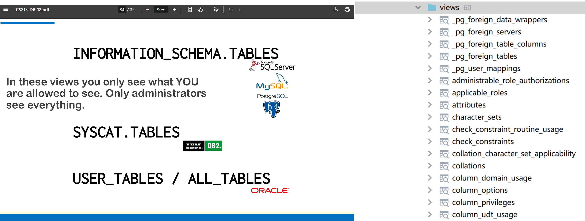

## 后续PPT在总结时未发布 所以使用了Github版本 （只给出少量建议）
https://github.com/EarendelH/SUSTech-CS213-Principle-of-Database_H

---
# Week 13
## full PPT:
我对这部分期待已久 PPT的内容和思路让人感到非常满意！
结合我提供的查询优化Lab和查询树Lab内容可以增强理解

---
# Week 14
## full PPT:
这部分可能会需要和openGauss结合

---
# Week 15
## full PPT:
很好的总结
