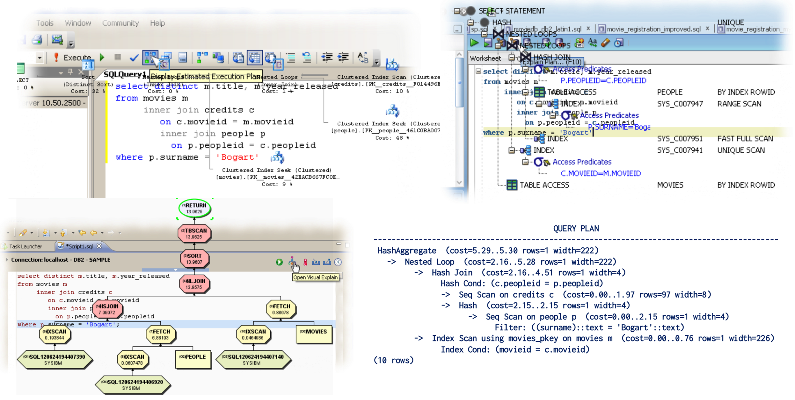
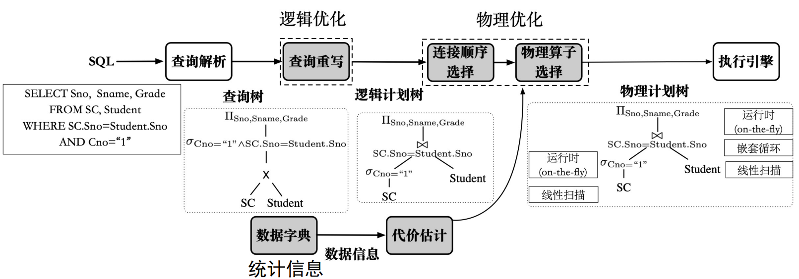
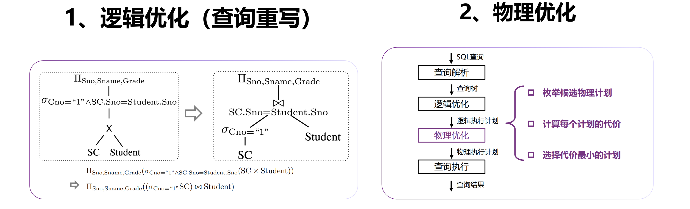
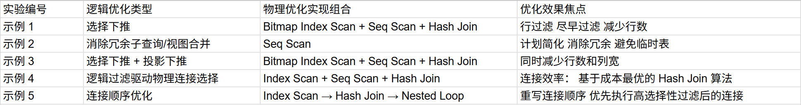
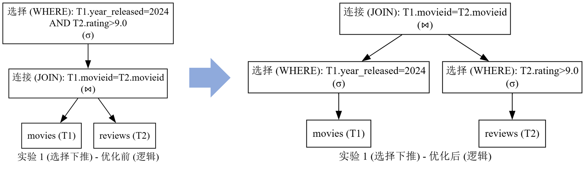
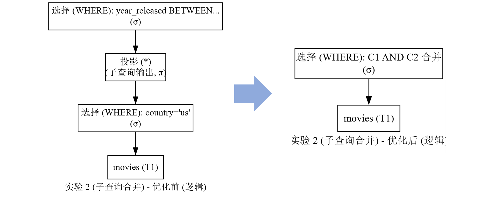
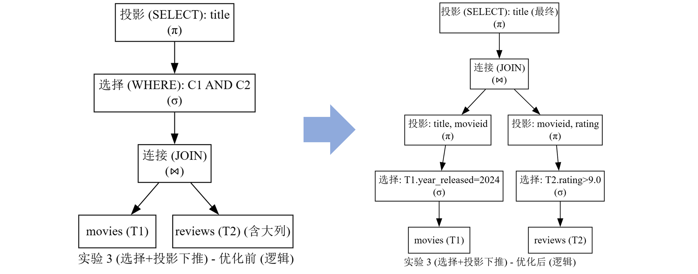
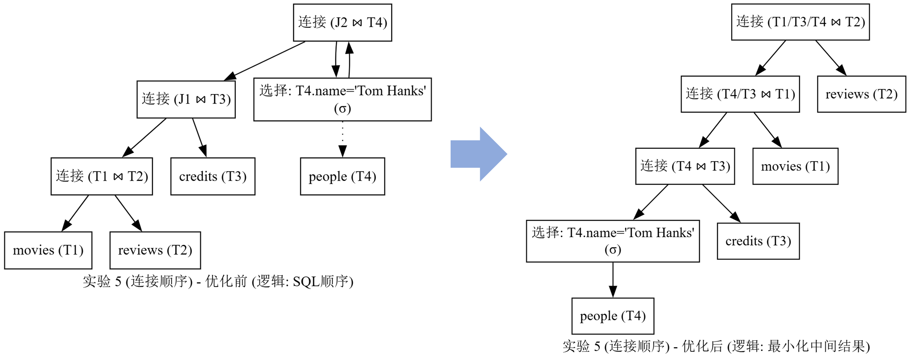

# <p align="center">PDS Project2 Report</p>
# <p align="center">Ways of Optimization部分</p>

**<p align="center">Masen Wen</p>**
**<p align="center">2025-12-05</p>**


* 实验代码&实验报告已上传Github
  * https://github.com/MasenWen

---

## 实验背景

#### 课上提及了这些内容(关系代数 逻辑/物理查询优化 查询树)但没有展开


#### 查询优化在数据处理过程中的位置
* **对每个操作进行时长估计** 计算出一种"足够(Reasonably)好"的策略
* **后续会实际执行这一策略**



##### 逻辑优化 & 物理优化
* **逻辑优化**依据很有限的几个优化策略进行尝试
* **物理优化**的枚举并不实际执行，而是使用估计值进行枚举，不用等待运行结果所以时间是$O(n_{cases})$而不是$O(\sum t_{case})$.




---


## 实验设计

##### 总览：5个实验的逻辑及物理优化类型




##### 实验涉及的逻辑优化方法总结 (基于关系代数)

##### 1. 选择 ($\sigma$) 与 选择下推 (Selection Push Down)

* **对应 SQL 操作：** `WHERE` 子句。
* **优化原理：** **选择**用于提取满足条件的行。选择下推是基于关系代数**等价规则**的逻辑优化，它将 $\sigma$ 操作推到连接 ($\bowtie$) 之前，以达到**尽早过滤行**的目的。
* **优化目标：** **减少流入连接阶段的数据量**（行数），提高后续操作的效率。
 
##### 2. 投影 ($\pi$) 与 投影下推 (Projection Push Down)

* **对应 SQL 操作：** `SELECT` 列表中的列。
* **优化原理：** **投影**用于提取指定的列。投影下推将 $\pi$ 操作推到连接 ($\bowtie$) 之前，**只保留需要的列**（包括连接键）。
* **优化目标：** **减少数据流的宽度**，通过剔除不需要的列（特别是巨大的列），节省 I/O 成本和内存消耗。

##### 3. 连接 ($\bowtie$) 与 连接顺序优化 (Join Ordering)

* **对应 SQL 操作：** `JOIN` 子句。
* **优化原理：** **连接**是组合关系的主要操作。连接顺序优化是基于关系代数**结合律**和**交换律**（$\bowtie$）的搜索策略。它不改变最终结果，但通过调整连接顺序来**最小化所有中间结果集**。
* **优化目标：** 目标是确保**优先执行高选择性过滤后的连接**，以实现整体查询效率的最优化。

##### 4. 消除冗余（Subquery Flattening / View Merging）

* **对应 SQL 操作：** 嵌套子查询、视图。
* **优化原理：** 这是一种**逻辑等价规则**，用于消除查询中的冗余结构。它将子查询或视图中的操作（如 $\sigma$ 或 $\pi$）与外部查询的操作**合并**。
* **优化目标：** 目标是消除不必要的**中间操作**（例如不需要的投影或临时表的物化），将复杂结构转化为**平面查询**。

##### 参考资料
* 数据库关系代数：https://zh.wikipedia.org/wiki/%E5%85%B3%E7%B3%BB%E4%BB%A3%E6%95%B0_(%E6%95%B0%E6%8D%AE%E5%BA%93)
* PostgreSQL官方文档：https://www.postgresql.org/docs/current/runtime-config-query.html

---


## 实验 1：选择下推（Selection Push Down）分析

| 描述 | 内容 |
| :--- | :--- |
| **优化类型** | 逻辑优化：选择下推 |
| **查询语句** | `SELECT T1.title FROM movies AS T1 JOIN reviews AS T2 ON T1.movieid = T2.movieid WHERE T1.year_released = 2024 AND T2.rating > 9.0;` |


```sql
EXPLAIN
SELECT T1.title FROM movies AS T1
    JOIN reviews AS T2 ON T1.movieid = T2.movieid
    WHERE T1.year_released = 2024 AND T2.rating > 9.0;
```

#### 实际执行计划（PostgreSQL）

```
1. Hash Join (cost=392.01..761.40 rows=324 width=16)
2.   Hash Cond: (t2.movieid = t1.movieid)
3.   -> Bitmap Heap Scan on reviews t2 (cost=65.59..426.40 rows=3265 width=4)
4.      Recheck Cond: (rating > '9'::double precision)
5.      -> Bitmap Index Scan on idx_reviews_rating (cost=0.00..64.77 rows=3265 width=0)
6.         Index Cond: (rating > '9'::double precision)
7.   -> Hash
8.      -> Seq Scan on movies t1 (cost=0.00..307.81 rows=1489 width=20)
9.         Filter: (year_released = 2024)
```

#### 1. 分析说明

1.  **对于 `reviews` 表 (T2) 的条件 `T2.rating > 9.0`：**
      * 这个条件被成功下推到了 `reviews` 表的访问路径上。
      * 在第 6 行可以看到：`Index Cond: (rating > '9'::double precision)`。这意味着数据库使用了 `idx_reviews_rating` 索引，并在**扫描索引阶段就完成了过滤**。
      * 由于过滤先于 Join 执行，极大地减少了流入 Hash Join 的 `reviews` 表数据量（尽管这里显示估算的行数 `rows=3265` 看起来较高，但这已经是在进行 Join 之前完成的过滤结果）。
2.  **对于 `movies` 表 (T1) 的条件 `T1.year_released = 2024`：**
      * 这个条件同样被成功下推。
      * 在第 9 行可以看到：`Filter: (year_released = 2024)`，这发生在 `movies` 表的 `Seq Scan` 之后、`Hash` 构建之前。
3.  **连接操作：**
      * 最终选择了 `Hash Join` 算法来连接预过滤后的两个表。

#### 2. 逻辑优化（目标）

* **目标：** 执行**选择下推（Selection Push Down）**。
* **转换：** 优化器将作用于单个表（$T1$ 或 $T2$）的过滤条件从 Join 操作的**上层**移动到各自表扫描的**下层**。
    * $\sigma_{T2.rating > 9.0}(T1 \bowtie T2) \implies T1 \bowtie \sigma_{T2.rating > 9.0}(T2)$

#### 3. 物理优化（实现）

* **对于 `reviews` 表 (T2) 过滤：** 优化器选择了 **`Bitmap Index Scan`**。条件 `(rating > '9')` 被转化为 `Index Cond`，在**索引读取阶段**就完成了过滤。
* **对于 `movies` 表 (T1) 过滤：** 优化器选择了 **`Seq Scan`**，并使用 `Filter: (year_released = 2024)` 在读取数据时进行过滤。
* **连接操作：** 优化器选择了 **`Hash Join`** 算法来连接经过预过滤的 $T1$ 和 $T2$ 两个结果集。

#### 4. 结论 

  * 优化器成功执行了**逻辑优化中的选择下推**，将两个 `WHERE` 条件都推到了各自表的扫描阶段完成过滤，遵循了**尽早过滤**的原则。




---

## 实验 2：消除冗余子查询/视图合并分析

| 描述 | 内容 |
| :--- | :--- |
| **查询语句** | ```EXPLAIN SELECT * FROM (SELECT * FROM movies WHERE country='us') AS us_movies WHERE year_released BETWEEN 1940 AND 1949; ``` |


```sql
EXPLAIN
SELECT *
    FROM (SELECT * FROM movies WHERE country='us') AS us_movies
    WHERE year_released BETWEEN 1940 AND 1949;
```

#### 实际执行计划（PostgreSQL）
```
1. Seq Scan on movies (cost=0.00..382.94 rows=367 width=31)
2. Filter: ((year_released >= 1940) AND (year_released <= 1949) AND (country = 'us'::bpchar))
```

#### 1. 分析说明

1.  **对于内部子查询条件 `country='us'`：**
      * 这个条件被成功**提升**（Push Up）到主查询的执行级别。
      * 在第 2 行可以看到：它与其他条件一起被合并在 `Filter` 中显示为 `(country = 'us'::bpchar)`。这意味着优化器成功地消除了子查询的逻辑边界。
      * 它作为所有条件的一部分，统一在 **`Seq Scan`** 阶段对行进行过滤。
2.  **对于外部查询条件 `year_released BETWEEN 1940 AND 1949`：**
      * 这个条件与子查询条件一起被**统一处理**。
      * 在第 2 行可以看到：它被分解并合并为 `(year_released >= 1940) AND (year_released <= 1949)`。这意味着所有过滤逻辑都被集中到一个物理操作点。
      * 这发生在唯一的表扫描操作 **`Seq Scan`** 中。
3.  **最终执行结构（实现）：**
      * 优化器成功执行了**子查询/视图合并**的逻辑优化。
      * 最终选择了 **`Seq Scan on movies`** 算法作为唯一的存取路径来访问数据。
      * 计划中没有出现 `Subquery Scan`、`View Scan` 或 `Materialize` 等节点，冗余的嵌套结构被完全消除。

#### 2. 逻辑优化（目标）

* **目标：** 执行**子查询/视图合并（Subquery/View Flattening）**。
* **转换：** 优化器识别出冗余的嵌套结构，并根据关系代数等价规则将子查询 (`us_movies`) 的过滤条件 **提升（Push Up）** 到主查询中，从而将整个查询逻辑上重写为一个单层的平面查询。

#### 3. 物理优化（实现）

* **存取路径：** 优化器选择了对基础表 `movies` 执行 **`Seq Scan`**（顺序扫描）。
* **过滤操作：** 所有来自原始嵌套查询的条件（包括子查询内部和主查询外部的条件）都被合并，并统一作为 **`Seq Scan`** 节点下的 **`Filter`** (第 2 行) 来执行。
* **证明：** 物理计划中没有为子查询生成独立的 `Scan` 或 `Materialize` 节点，证明了逻辑上的合并转换已在物理实现中落地。




---

## 实验 3：选择下推 + 投影下推分析

| 描述 | 内容 |
| :--- | :--- |
| **优化类型** | **逻辑优化**：选择下推（Selection Push Down） **+ 投影下推**（Projection Push Down） |
| **假设前提** | **假设** `reviews` 表（T2）有一个**巨大的列(这显然成立)** `review_text`，但查询中不需要。 |
| **查询语句** | ` SELECT T1.title FROM movies AS T1 JOIN reviews AS T2 ON T1.movieid = T2.movieid WHERE T1.year_released = 2024 AND T2.rating > 9.0;  ` |

```sql
EXPLAIN
SELECT T1.title FROM movies AS T1
    JOIN reviews AS T2 ON T1.movieid = T2.movieid
    WHERE T1.year_released = 2024 AND T2.rating > 9.0;
```

#### 实际执行计划（PostgreSQL）

```
1. Hash Join (cost=392.01..761.40 rows=324 width=16)
2.   Hash Cond: (t2.movieid = t1.movieid)
3.   -> Bitmap Heap Scan on reviews t2 (cost=65.59..426.40 rows=3265 width=4)
4.      Recheck Cond: (rating > '9'::double precision)
5.      -> Bitmap Index Scan on idx_reviews_rating (cost=0.00..64.77 rows=3265 width=0)
6.         Index Cond: (rating > '9'::double precision)
7.   -> Hash
8.      -> Seq Scan on movies t1 (cost=0.00..307.81 rows=1489 width=20)
9.         Filter: (year_released = 2024)
```

#### 1. 分析说明

1.  **关于选择下推 (Selection Push Down)：**
      * **成功实现。** 针对 `reviews` 表的条件 `T2.rating > 9.0` 被成功下推到表扫描阶段，通过 `Index Cond`（第 6 行）在 Join 之前完成过滤。
      * 针对 `movies` 表的条件 `T1.year_released = 2024` 也被下推到 `Seq Scan` 节点的 `Filter`（第 9 行）中。
2.  **关于投影下推 (Projection Push Down)：**
      * **间接证明成功。** 由于您没有提供 `EXPLAIN (VERBOSE)` 输出，我们无法直接看到 `reviews` 表扫描节点的 `Output` 列表中是否包含 `review_text`。
      * **证据：** `Bitmap Heap Scan` on `reviews` 节点的 `width=4`（第 3 行），`width` 代表该节点输出的**平均字节宽度**。如果 `review_text` 是一个巨大的列（例如 1000 字节），且没有被优化器排除，那么这个 `width` 值将远大于 4。**`width=4` 强烈暗示优化器已经排除了不必要的巨大列**，只输出了必需的列（如 `movieid` 和 `rating`），从而完成了投影下推。
3.  **连接操作：**
      * 优化器选择了 **`Hash Join`** 算法来连接经过选择下推优化后的两个输入。

#### 2. 逻辑优化（目标）

  * **目标：** 同时执行**选择下推 ($\sigma$)** 和**投影下推 ($\pi$)**。
  * **选择转换：** $\sigma_{T2.\text{rating} > 9.0}(T1 \bowtie T2) \implies T1 \bowtie \sigma_{T2.\text{rating} > 9.0}(T2)$。
  * **投影转换：** 优化器将 $\pi_{\text{title}}$ 下推到 `reviews` 表扫描之上，只保留连接键 (`movieid`) 和过滤键 (`rating`)，并丢弃所有不需要的列（如假设的 `review_text`）。

#### 3. 物理优化（实现）

  * **选择实现：**
      * **`reviews` 表 (T2)：** 选择了 **`Bitmap Index Scan`**，利用 `Index Cond` 实现高效过滤。
      * **`movies` 表 (T1)：** 选择了 **`Seq Scan`**，利用 `Filter` 实现过滤。
  * **投影实现：**
      * 优化器在 `Bitmap Heap Scan` 阶段（第 3 行）实现了投影下推，**避免读取假设中巨大的 `review_text` 列**，证据是输出宽度 `width=4` 极小，显著减少了 I/O 成本和后续 Hash 阶段的内存占用。
  * **连接算法：** 选择了 **`Hash Join`** 算法来连接这两个经过双重优化的结果集。

#### 4. 结论 

  * 优化器成功展示了**选择下推**的效率，同时 `width=4` 的观察强烈证明了**投影下推**也已成功实现，体现了逻辑优化器对行和列的全面优化。





---

## 实验 4：连接算法选择（Hash Join vs. NLJ）分析

| 描述 | 内容 |
| :--- | :--- |
| **查询语句** | ` SELECT T1.movieid, T2.first_name FROM credits AS T1 JOIN people AS T2 ON T1.peopleid = T2.peopleid WHERE T2.peopleid BETWEEN 10000 AND 10100;  ` |

```sql
EXPLAIN 
SELECT T1.movieid, T2.first_name  FROM credits AS T1
    JOIN people AS T2 ON T1.peopleid = T2.peopleid
    WHERE T2.peopleid BETWEEN 10000 AND 10100;
```

#### 实际执行计划（PostgreSQL）
```
1. Hash Join (cost=11.94..1028.62 rows=54 width=10)
2. Hash Cond: (t1.peopleid = t2.peopleid)
3. -> Seq Scan on credits t1 (cost=0.00..868.70 rows=56370 width=8)
4. -> Hash
5. -> Index Scan using people_pkey on people t2 (cost=0.29..10.59 rows=108 width=10)
6. Index Cond: ((peopleid >= 10000) AND (peopleid <= 10100))
```

#### 1. 分析说明

1.  **对于 `people` 表 (T2) 的过滤条件 `T2.peopleid BETWEEN 10000 AND 10100`：**
      * 这个条件被成功下推到了 `people` 表的访问路径上。
      * 在第 6 行可以看到：`Index Cond: ((peopleid >= 10000) AND ...)`。这意味着数据库使用了 `people_pkey` 索引，并在**扫描索引阶段就完成了过滤**。
      * 过滤使得流入连接操作的 `people` 表数据量极小（估算 `rows=108`）。
2.  **对于 `credits` 表 (T1)：**
      * 这个表没有过滤条件，优化器选择了 **`Seq Scan`** 进行全表扫描（估算 `rows=56370`），作为 Join 的一个输入。
3.  **连接操作选择：**
      * 最终选择了 **`Hash Join`** 算法来连接一个大表 (`credits` T1) 和一个预过滤后的小结果集 (`people` T2)。小结果集 T2 被用于构建哈希表（第 4 行的 `Hash` 节点）。

#### 2. 逻辑优化（目标）

  * **目标：** 执行**选择下推（Selection Push Down）**。
  * **转换：** 优化器将作用于 `people` 表（T2）的过滤条件从 Join 操作的**上层**移动到该表扫描的**下层**。
  * $\sigma_{T2.\text{peopleid} \in \text{Range}}(T1 \bowtie T2) \implies T1 \bowtie \sigma_{T2.\text{peopleid} \in \text{Range}}(T2)$。

#### 3. 物理优化（实现）

  * **存取路径选择：**
      * **`people` 表 (T2)：** 选择了 **`Index Scan`**，利用索引高效实现过滤。
      * **`credits` 表 (T1)：** 选择了 **`Seq Scan`**。
  * **连接算法选择：**
      * 优化器选择了 **`Hash Join`**（第 1 行），而非 Nested Loop Join（NLJ）或 Merge Join。
      * **实现机制：** 将过滤后的 **小结果集 T2** 用于构建内存中的哈希表（第 4 行），将 **大表 T1** 用于探测该哈希表，这在处理大输入时通常是最快的连接物理实现。

#### 4. 结论 

  * 优化器成功展示了**物理优化**的核心：根据逻辑优化（选择下推）产生的**输入关系大小差异**，选择了基于成本最优的 **`Hash Join`** 连接算法。


---

## 实验 5：搜索策略 — 多表连接顺序优化分析

| 描述 | 内容 |
| :--- | :--- |
| **优化类型** | **搜索策略优化**：连接顺序优化（Join Ordering） |
| **涉及四表** | `movies` (T1), `reviews` (T2), `credits` (T3), `people` (T4) |
| **查询语句** | 查找演员“Tom Hanks”的电影及评分。 |


```sql
EXPLAIN
SELECT
    T1.title,
    T4.first_name || ' ' || surname,
    T2.rating
FROM
    movies AS T1
JOIN
    reviews AS T2 ON T1.movieid = T2.movieid
JOIN
    credits AS T3 ON T1.movieid = T3.movieid
JOIN
    people AS T4 ON T3.peopleid = T4.peopleid
WHERE
    T4.first_name = 'Tom' and T4.surname = 'Hanks';
```

#### 实际执行计划（PostgreSQL）

```
1. Nested Loop (cost=9.02..1025.79 rows=1 width=56)
2.   Join Filter: (t1.movieid = t2.movieid)
3.   -> Nested Loop (cost=8.73..1025.45 rows=1 width=37)
4.      -> Hash Join (cost=8.45..1025.13 rows=1 width=17)
5.         Hash Cond: (t3.peopleid = t4.peopleid)
6.         -> Seq Scan on credits t3 (cost=0.00..868.70 rows=56370 width=8)
7.         -> Hash (cost=8.44..8.44 rows=1 width=17)
8.            -> Index Scan using people_surname_first_name_key on people t4 (cost=0.42..8.44 rows=1 width=17)
9.               Index Cond: (((surname)::text = 'Hanks'::text) AND ((first_name)::text = 'Tom'::text))
10.      -> Index Scan using movies_pkey on movies t1 (cost=0.29..0.31 rows=1 width=20)
11.         Index Cond: (movieid = t3.movieid)
12.   -> Index Scan using pk_reviews_movieid on reviews t2 (cost=0.29..0.33 rows=1 width=12)
13.      Index Cond: (movieid = t3.movieid)
```

### 1. 分析说明

1.  **高选择性过滤 (T4)：**
      * 优化器首先在第 8 行对 `people` 表 (T4) 执行 **`Index Scan`**，利用高选择性条件 `T4.name = 'Tom Hanks'` 进行过滤（`Index Cond`，第 9 行）。
      * 结果估算为 `rows=1`，表明过滤效率极高。
2.  **首次连接 (T4 $\bowtie$ T3)：**
      * 优化器选择了 **`Hash Join`**（第 4 行）将极小的过滤结果集 T4 和大表 `credits` (T3) 连接起来。T3 进行了全表 **`Seq Scan`**（第 6 行）。
      * **重写证明：** 这个 $\text{people} \bowtie \text{credits}$ 的连接在执行计划中处于最深的嵌套层级，表明优化器**重写**了 SQL 语句中 Join 的顺序，优先处理了包含高选择性条件的连接，极大地减小了后续操作的中间结果集。
3.  **后续连接顺序：**
      * 第一次连接的结果 (`T4 \bowtie T3` 结果集，估算 `rows=1`) 然后作为外部输入，通过 **`Nested Loop`** 连接到 `movies` (T1) 表（第 3-10 行）。
      * 最后，将这三表连接的结果再通过最外层的 **`Nested Loop`** 连接到 `reviews` (T2) 表（第 1-12 行）。

### 2. 逻辑优化（目标）

  * **目标：** 执行**连接顺序优化（Join Ordering）**。
  * **转换：** 优化器根据**最小化中间结果集**的原则，使用**动态规划**等搜索策略，重写了关系代数表达式中连接操作的顺序。
      * **优化器选择的顺序：** $(\sigma_{\text{name}}(T4) \bowtie T3) \bowtie T1 \bowtie T2$
      * **证明：** 计划结构与 SQL 语句中 `T1 \bowtie T2 \bowtie T3 \bowtie T4` 的顺序**完全不同**，优先执行了高选择性 $\sigma_{\text{name}}(T4)$ 附近的连接。

#### 3. 物理优化（实现）

  * **搜索策略实现：** 优化器通过探索等价的连接顺序树，最终选择了一个混合连接算法的执行路径。
  * **物理实现：**
      * **高选择性连接：** 优先使用 **`Index Scan`** 对 T4 过滤，然后使用 **`Hash Join`** 实现 $(\text{people} \bowtie \text{credits})$。
      * **后续连接：** 采用 **`Nested Loop`** (NLJ) 连接剩余的表。由于 T4 $\bowtie$ T3 的结果集极小 (`rows=1`)，NLJ 成为连接到 T1 和 T2 的高效选择，因为只需对 T1 和 T2 进行极少次数的索引查找（第 10、12 行）。

#### 4. 结论 

  * 优化器成功展示了**搜索策略优化**的核心：通过**重写连接顺序**，优先执行高选择性过滤后的连接，并在后续步骤中根据输入集大小混合使用了 `Hash Join` 和 `Nested Loop` 算法，提高了查询效率。



---

## 参考资料

* **https://www.cnblogs.com/cpaulyz/p/14671793.html**
* **https://dbgroup.cs.tsinghua.edu.cn/ligl/courses/slides11.pdf**


